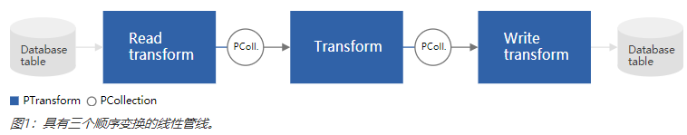
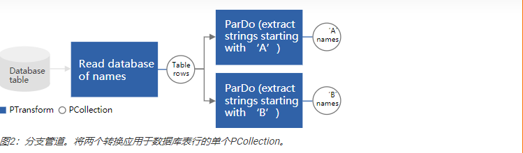
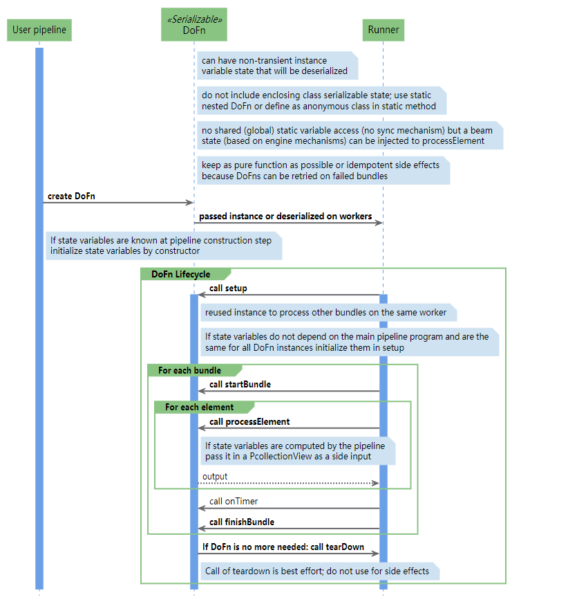
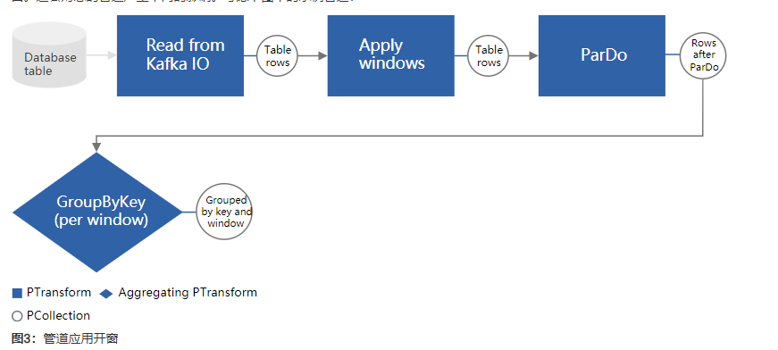
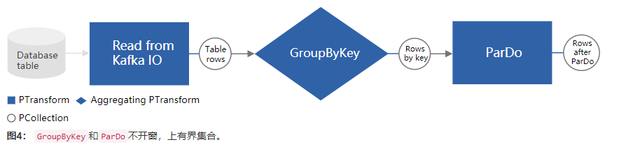
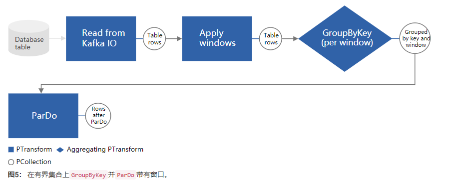
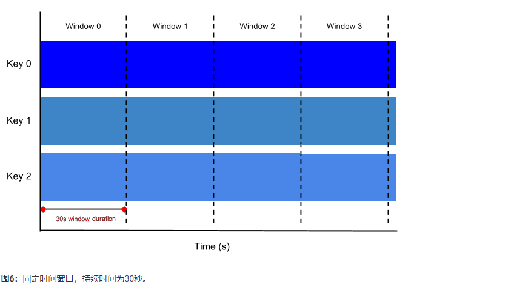
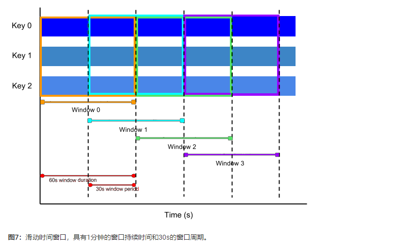
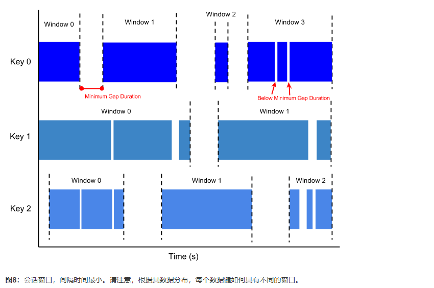
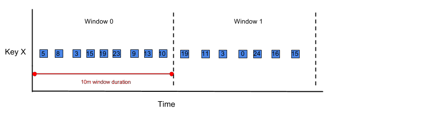

# Apache Beam编程指南
《Beam编程指南》适用于希望使用Beam SDK来创建数据处理管道的Beam用户。它提供有关使用Beam SDK类来构建和测试管道的指南。它不打算作为详尽的参考，而是作为语言不可知的高级指南，以编程方式构建Beam管道。在完成编程指南后，文本将包含多种语言的代码示例，以帮助说明如何在管道中实现Beam概念。
## 1. 概述
要使用Beam，您需要首先使用其中一个Beam SDK中的类创建驱动程序。您的驱动程序定义了管道，包括所有的输入，转换和输出。它还为您的管道设置执行选项（通常使用命令行选项传递）。这些包括管道运行器，该管道运行器反过来确定您的管道将在哪个后端运行。
Beam SDK提供了许多抽象，简化了大规模分布式数据处理的机制。相同的Beam抽象适用于批处理和流数据源。创建Beam管道时，可以根据这些抽象来考虑数据处理任务。它们包括：

- `Pipeline`：A `Pipeline`从头到尾封装了您的整个数据处理任务。这包括读取输入数据，转换该数据以及写入输出数据。所有Beam驱动程序必须创建一个`Pipeline`。创建时`Pipeline`，还必须指定执行选项，告诉执行`Pipeline`位置和运行方式。
- `PCollection`：A `PCollection`表示您的Beam管道在其上运行的分布式数据集。数据集可以是有界的，这意味着它来自文件之类的固定来源，也可以是无界的，这意味着它来自通过订阅或其他机制不断更新的资源。您的管道通常`PCollection`通过从外部数据源读取数据来创建首字母缩写，但是您也可以`PCollection`在驱动程序中从内存中数据创建首字母。从那里开始，PCollections是管道中每个步骤的输入和输出。
- `PTransform`：A `PTransform`表示管道中的数据处理操作或步骤。每个对象都`PTransform`将一个或多个`PCollection`对象作为输入，执行对该元素提供的处理功能`PCollection`，并产生零个或多个输出`PCollection`对象。
- I / O转换：Beam带有许多"IO"- PTransform用于将数据读取或写入各种外部存储系统的库。

典型的Beam驱动程序程序的工作原理如下：
- 创建一个Pipeline对象并设置管道执行选项，包括管道运行器。
- PCollection使用IO从外部存储系统读取数据，或使用Create转换PCollection从内存中数据构建数据，为管道数据创建一个初始数据。
- 应用 PTransform s到每个PCollection。变换可以更改，过滤，分组，分析或以其他方式处理元素PCollection。转换PCollection 无需修改输入集合即可创建新的输出。典型的流水线PCollection依次将后续转换应用于每个新输出，直到处理完成。但是，请注意，流水线不必一定是一个接一个地应用的变换的直线：将PCollections作为变量，将PTransforms作为应用于这些变量的函数：流水线的形状可以是任意复杂的处理图。
- 使用IO将最终的转换后的数据写入PCollection外部源。
- 使用指定的管道运行器运行管道。

当您运行您的Beam驱动程序时，您指定的管道运行器 根据“PCollection”构建您的管道的工作流图 您已创建并转换已应用的对象。 那个图是那个 使用适当的分布式处理后端执行，成为 异步“作业”（或等效的）在后端。
## 2. 创建管道
该Pipeline抽象封装了所有的数据和步骤在您的数据处理任务。Beam驱动程序通常首先构造一个 Pipeline 对象，然后将该对象用作创建PCollections 的管道数据集和创建Transforms的基础。

要使用Beam，驱动程序必须首先创建Beam SDK类的实例Pipeline（通常在main()函数中）。在创建自己的文件时 Pipeline，您还需要设置一些配置选项。您可以通过编程方式设置管道的配置选项，但通常更容易提前设置选项（或从命令行读取它们），然后Pipeline在创建对象时将其传递给对象。
```java
// Start by defining the options for the pipeline.
PipelineOptions options = PipelineOptionsFactory.create();

// Then create the pipeline.
Pipeline p = Pipeline.create(options);
```
### 2.1 配置管道选项
使用管道选项可以配置管道的不同方面，例如将执行管道的管道运行器以及所选运行器所需的任何特定于运行器的配置。您的管道选项可能会包含诸如项目ID或用于存储文件的位置之类的信息。

当您在选择的运行器上运行管道时，您的代码将获得PipelineOptions的副本。例如，如果将PipelineOptions参数添加到DoFn的@ProcessElement方法中，它将由系统填充。

#### 2.1.1 从命令行参数设置PipelineOptions
虽然可以通过创建PipelineOptions对象并直接设置字段来配置管道，但Beam SDK包含命令行解析器，可用于在PipelineOptions使用命令行参数时设置字段。

要从命令行读取选项，请PipelineOptions按照以下示例代码所示构造您的对象：
```java
PipelineOptions options =
    PipelineOptionsFactory.fromArgs(args).withValidation().create();
```

这种格式遵循以下格式的命令行参数：
```java
--<option>=<value>
```
    注意：追加方法.withValidation将检查必需的命令行参数并验证参数值。
通过`PipelineOptions`这种方式构建，可以将任何选项指定为命令行参数。
#### 2.1.2 创建自定义选项
您可以在标准之外添加自己的自定义选项 `PipelineOptions`。要添加自己的选项，请为每个选项定义一个带有getter和setter方法的接口，如以下添加`input`和`output`自定义选项的示例所示：

```java
public interface MyOptions extends PipelineOptions {
    String getInput();
    void setInput(String input);
    
    String getOutput();
    void setOutput(String output);
}
```

您还可以指定一个描述（`--help`默认值），该描述在用户作为命令行参数传递时出现。您可以使用注释设置描述和默认值。如下所示：
```java
public interface MyOptions extends PipelineOptions {
    @Description("Input for the pipeline")
    @Default.String("gs://my-bucket/input")
    String getInput();
    void setInput(String input);

    @Description("Output for the pipeline")
    @Default.String("gs://my-bucket/output")
    String getOutput();
    void setOutput(String output);
}
```
建议您向其注册接口，`PipelineOptionsFactory` 然后在创建`PipelineOptions`对象时传递该接口。当您使用注册接口时`PipelineOptionsFactory`，--help可以找到您的自定义选项接口并将其添加到--help命令的输出中。 `PipelineOptionsFactory`还将验证您的自定义选项是否与所有其他已注册选项兼容。

以下示例代码显示了如何使用来注册您的自定义选项界面`PipelineOptionsFactory`：
```java
PipelineOptionsFactory.register(MyOptions.class);
MyOptions options = PipelineOptionsFactory.fromArgs(args)
                                                .withValidation()
                                                .as(MyOptions.class);
```
现在，您的管道可以接受--input=value和--output=value作为命令行参数。

## 3. PCollections
`PCollection` 描述为表示潜在分布，多元素的数据集。您可以将其 `PCollection` 视为“管道”数据；`Beam 转换`使用`PCollection`对象作为输入和输出。因此，如果要在管道中使用数据，则数据必须采用的形式`PCollection`。

创建完`Pipeline`之后，您需要首先`PCollection`以某种形式创建至少一个。在`PCollection` 您创建作为输入你的管道中第一个操作。

### 3.1 创建一个PCollection
您可以通过使用Beam的`Source API`从外部源读取数据来创建`PCollection`，也可以在驱动程序中的内存中的收集类中创建存储的数据作为`PCollection`。前者通常是生产管道将如何提取数据；Beam的源API包含适配器，可帮助您从外部资源（例如基于云的大型文件，数据库或订阅服务）中读取信息。后者主要用于测试和调试目的。

#### 3.1.1 从外部读取
要从外部来源读取，请使用`Beam提供的I / O适配器`之一。适配器的确切用法有所不同，但是它们全部从某个外部数据源读取并返回，`PCollection`其元素表示该源中的数据记录。

每个数据源适配器都有一个`Read`转换。要明白，您必须将该转换应用于`Pipeline`对象本身。 例如，从外部文本文件读取并返回其元素类型为`String`的元素，每个`String`元素 代表文本文件中的一行。以下是你如何通过应用`TextIO.Read`为你的`Pipeline`创建一个`PCollection`:

```java
public static void main(String[] args) {
    // Create the pipeline.
    PipelineOptions options =
        PipelineOptionsFactory.fromArgs(args).create();
    Pipeline p = Pipeline.create(options);

    // Create the PCollection 'lines' by applying a 'Read' transform.
    PCollection<String> lines = p.apply(
      "ReadMyFile", TextIO.read().from("gs://some/inputData.txt"));
}
```

请参阅有关I / O的部分，以了解有关如何从Beam SDK支持的各种数据源读取信息的更多信息。

#### 3.1.2 从内存中的数据创建PCollection
要从`PCollection`内存Java 创建`Collection`，请使用Beam提供的`Create`转换。就像数据适配器一样`Read`，您可以`Create`直接将`Pipeline`其应用于 对象本身。

作为参数，`Create`接受Java `Collection`和`Coder`对象。在 `Coder` 指定的元素对应的 `编码`。

以下示例代码显示了如何从内存中创建一个`List`的`PCollection`:

```java
public static void main(String[] args) {
    // Create a Java Collection, in this case a List of Strings.
    final List<String> LINES = Arrays.asList(
      "To be, or not to be: that is the question: ",
      "Whether 'tis nobler in the mind to suffer ",
      "The slings and arrows of outrageous fortune, ",
      "Or to take arms against a sea of troubles, ");

    // Create the pipeline.
    PipelineOptions options =
        PipelineOptionsFactory.fromArgs(args).create();
    Pipeline p = Pipeline.create(options);

    // Apply Create, passing the list and the coder, to create the PCollection.
    p.apply(Create.of(LINES)).setCoder(StringUtf8Coder.of());
}
```
### 3.2 PCollection的特征

`PCollection`由`Pipeline`为其创建的特定对象所拥有；多个管道不能共享一个`PCollection`。在某些方面，一个`PCollection`函数像一个`Collection`类。但是，`PCollection`在一些关键方面可能有所不同：

#### 3.2.1 元素类型
`PCollection`的元素可以是任何类型，但必须都属于同一类型。但是，为了支持分布式处理，`Beam`需要能够将每个单独的元素编码为字节字符串（以便可以将元素传递给分布式工作程序）。`Beam SDK`提供了一种数据编码机制，该机制包括针对常用类型的内置编码以及根据需要指定自定义编码的支持。

#### 3.2.2 元素架构
在许多情况下，`PCollection`中的元素类型具有可以自省的结构。示例包括JSON，协议缓冲区，Avro和数据库记录。模式提供了一种将类型表示为一组命名字段的方法，从而可以进行更具表现力的聚合。

#### 3.2.3 不变性
`PCollection`是不可变的。创建后，您将无法添加，删除或更改单个元素。`Beam Transforms `可以处理的每个元素 `PCollection` 并生成新的管道数据（作为新数据`PCollection`），但是它不会消耗或修改原始输入集合。

#### 3.2.4 随机访问
`PCollection`不支持随机访问单个元素。相反，`Beam Transforms`会单独考虑`PCollection`中的每个元素。

#### 3.2.5 大小和边界
`PCollection`是一个大型的，不变的元素'袋'，`PCollection`可以包含多少元素是没有上限的。任何给定的数据都可能适合单个计算机上的内存，或者可能表示由持久性数据存储支持的非常大的分布式数据集。

`PCollection`的大小可以是有界的或者无界的，有界`PColeection`代表已知大小固定的数据集，而无界`PCollection`代表无限大小的数据集。`PCollection`是有界或者是无界取决于它表示的数据集的数据源。从批处理数据源（例如文件或者数据库）读取会创建一个有界`PCollection`，从流/连续更新的数据源（例如Pub、Sub、kafka）中读取数据会创建一个无边界`PCollection`（除非您明确告知不要这么做）。

您的`有界或者无界PCollection`会影响Beam处理数据的方式。`PCollection`可以使用批处理作业来处理有界作业，该批处理作业可能一次读取整个数据集，并在有限长度的作业中执行处理。无边界`PCollection`必须使用连续运行的流处理来处理，因为整个集合永远无法用于处理。

Beam使用`开窗`将连续更新的无线范围的`PCollection`划分为有限大小的逻辑窗口，这些逻辑窗口由与数据元素关联的某些特性（例如`timestamp`）决定。聚合转换（例如`GroupByKey`和`Combine`）在每个窗口的基础上工作-例如在生成数据集时，它们将这些PCollection作为有限窗口的连续序列进行处理。

#### 3.2.6 元素时间戳
`PCollection`中的每个元素都有一个关联的固有时间戳。每个元素的时间戳最初由`PCollection`创建的来源分配。创建无边界的`PCollection`通常会为每一个新元素分配一个时间戳，该时间戳与读取或添加元素的时间相对应。

    注意：PCollection为固定数据集创建边界的源也会自动分配时间戳，但是最常见的行为是为每个元素分配相同的时间戳（Long.MIN_VALUE）。

包含时间戳的`PCollection`对于具有固有时间概念的元素有用，如果您的管道正在读取事件流（例如Tweets或其他社交媒体消息），则每个元素都可以将事件发布的时间作为时间戳。

如果创建`PCollection`的源不为您提供时间戳，则可以手动将时间戳分配给元素。如果元素具有固有的时间戳，但是时间戳在元素本身结构中的某个位置（例如服务器日志条目中的“时间”字段），则需要执行手动分配。Beam具有采用`PCollection`作为输入和输出带有时间戳的相同`PCollection`的`Transforms`；有关如何这样做的更多信息，请参阅添加([时间戳](https://beam.apache.org/documentation/programming-guide/#adding-timestamps-to-a-pcollections-elements)) 。

## 4 转换（Transforms）
`Transforms`是管道中的操作，并提供通用的处理框架。您以功能对象的形式（通常称为'用户代码'）提供处理逻辑，并将您的用户代码应用于输入的每个元素`PCollection`（或多个`PCollection`）。根据您选择的管道运行器和后端，集群中的许多不同的工作程序可能并行执行用户代码的示例。在每个工作程序上运行的用户代码生成输出元素，这些输出元素最终被添加到`PCollection`转换产生的最终输出中。

Beam SDK包含许多不同的转换，您可以将它们应用于管道的`PCollection`。这些转换包括通用核心转换，例如`ParDo`或`Combine`。SDk中还包含预编写的`复合转换`,它们以一种有用的处理模式（例如对集合中的元素进行计数或组合）组合了一个或多个核心转换。您还可以定义自己的更复杂的复合转换，已适合管道的确切用例。

### 4.1 应用转换
`PCollection`要调用转换，必须将其应用于`input`。Beam SDk中的每一个转换都有一个通用apply方法。调用多个Beam转换类似于方法链接，但是有一点点不同：将转换应用于输入`PCollection`，将转换本身作为参数传递，然后操作返回输出`PCollection`。采取一般形式：
```java
[Output PCollection] = [Input PCollection].apply([Transform])
```
由于Beam使用`PCollection`的通用`apply`方法，因此您既可以顺序链接转换，也可以应用包含嵌套的其他转换的转换（在Beam SDK中称为复合转换）。

如何应用您的管道转换决定了您的管道的结构。管道的最佳方式是将其视为有向无环图，其中`PTransform`节点是接受PCollection节点作为输入并将PCollection节点作为输出的子例程。例如，您可以将转换串联在一起，以创建一个连续修改输入数据的管道：
```java
[Final Output PCollection] = [Initial Input PCollection].apply([First Transform])
.apply([Second Transform])
.apply([Third Transform])
```
该管道的图形如下所示：



但是，请注意转换不会使用或改变输入集合。请记住，根据定义，PCollection是不可变的。这意味着您可以对同一个输入PCollection应用多个转换来创建分支管理，如下所示：
```java
[PCollection of database table rows] = [Database Table Reader].apply([Read Transform])
[PCollection of 'A' names] = [PCollection of database table rows].apply([Transform A])
[PCollection of 'B' names] = [PCollection of database table rows].apply([Transform B])
```

该分支管道的图形如下所示：



您还可以构建自己的复合转换，将多个转换嵌套在一个较大的转换中。复合转换对于构建一个可重复使用的简单步骤序列特别有用，这些步骤可以在很多不同的地方使用。

### 4.2 核心 Beam transforms
Beam提供以下核心转换，每个核心转换代表一个不同的处理规范：
- ParDo
- GroupByKey
- CoGroupByKey
- Combine
- Flatten
- Partition

#### 4.2.1 ParDo
`ParDo`是一种用于通用并行处理的`Beam transforms`。`ParDo`处理范式类似于`Map/Shuffle/Reduce-style算法`的"Map"阶段: `ParDo`转换考虑输入`PCollection`中的每一个元素，对该元素执行一些处理函数（您的用户代码）并发出零，一个或者多个元素组成一个输出`PCollection`。 

`ParDo`可以用于处理各种常见的数据处理操作，包括：
- 过滤数据集。您可以使用`ParDo`来考虑`PCollection`中的每个元素，并将该元素输出到新的集合中，或者将其丢弃。
- 对数据集中的每个元素进行格式化或者类型转换。如果您的输入`PCollection`包含的元素的类型或格式与您想要的不一样，您可以使用`ParDo`对每个元素执行转换，并将结果输出到新的`PCollection`中。
- 抽取数据集中的每个元素的部分。例如，如果您拥有一个包含多个字段的`PCollection`记录，您可以使用`ParDo`将仅需要考虑的字段解析为一个新的`PCollection`。
- 对数据集中的每个元素执行计算。您可以使用`ParDo`对`PCollection`的每个元素或某些元素执行简单或复杂的计算，并将结果作为新的`PCollection`输出。

在这样的角色中，`ParDo`是一个管道中常见的中间步骤，您可以用它从一组原始输入记录中提取某些字段，或者将原始输入转换为另一种格式；您也可能用`ParDo`将处理过的数据转换为合适输出的格式，如数据表行或可打印字符串。

应用`ParDo`转换时，需要以`DoFn`对象的形式提供用户代码。`DoFn`是一个`Beam SDk`类，定义了一个分布式处理函数。

    当您创建子类DoFn时，请注意，您的子类应该遵守为Beam转换编写用户代码的要求
    
##### 4.2.1.1 应用ParDo
像所有`Beam`转换一样，通过调用输入`PCollection`的`apply`方法并将`ParDo`作为参数传递，可以应用`ParDo`，如下所示的示例代码：
```java
// The input PCollection of Strings.
PCollection<String> words = ...;

// The DoFn to perform on each element in the input PCollection.
static class ComputeWordLengthFn extends DoFn<String, Integer> { ... }

// Apply a ParDo to the PCollection "words" to compute lengths for each word.
PCollection<Integer> wordLengths = words.apply(
    ParDo
    .of(new ComputeWordLengthFn()));        // The DoFn to perform on each element, which
                                            // we define above.
```

在示例中，我们的输入PCollection包含String值。我们应用一个ParDo变换，指定一个函数（ComputeWordLengthFn）来计算每个串的长度，并将结果输出到一个新PCollection的Integer值，其存储每个String值得长度。

##### 4.2.1.2 创建一个DoFn
传递给`ParDo`的`DoFn`对象包含应用到输入集合的元素的处理逻辑。当你使用`Beam`时，你编写的最重要的代码片段通常是这些`DoFn`，它们定义了管道的确切数据处理任务。

    注意，在创建DoFn时，请注意为Beam转换编写用户代码的要求，并确保您的代码遵循这些要求。

`DoFn`每次处理输入`PCollection`的每一个元素。当您创建`DoFn`的子类时，您需要提供与输入和输出元素的类型相匹配的类型参数。如果您的`DoFn`处理传入的`String`元素并为输出集合生成`Integer`元素（如我们前面的`ComputeWordLengthFn` ），您的类声明将如下所示：

```java
static class ComputeWordLengthFn extends DoFn<String, Integer> { ... }
```

在`DoFn`子类中，您将编写一个用`@ProcessElement`注释的方法，在其中提供实际的处理逻辑。您不需要从输入集合中手动提取元素；`Beam SDK`会为你处理这些元素。您的`@ProcessElement`方法应该接受一个标记为`@Element`的参数，这个参数将用`input`元素填充。为了输出元素，该方法还可以采用`OutputReceiver`类型的参数，它提供输出元素的方法。参数类型必须与`DoFn`的输入和输出类型匹配，否则框架将引发错误。注：`@Element`和`OutputReceiver`是`Beam 2.5.0`中引入的，如果使用`Beam`的早期版本，应该使用`ProcessContext`的参数。

```java
static class ComputeWordLengthFn extends DoFn<String, Integer> {
  @ProcessElement
  public void processElement(@Element String word, OutputReceiver<Integer> out) {
    // Use OutputReceiver.output to emit the output element.
    out.output(word.length());
  }
}
```

    如果输入`PCollection`中的元素是键值对，则可以分别使用`element.getKey()`或来访问键或值`element.getValue()`。

给定的`DoFn`实例通常被调用一次或者多次以处理任意的元素包。但是，Beam无法保证调用次数；它可能在给定的工作节点上被多次调用，以解决失败和重试。因此，可以在处理方法的多个调用之间缓存信息，但是如果这样做，请确保实现不依赖与调用的次数。

在您的处理方法中，您还需要满足一些不变性要求，以确保Beam和处理后端能够安全地序列化和缓存管道中的值。您的方法需要满足以下要求：

- 您不应该以任何方式修改`@Element注解`或者`ProcessContext.sideInput()`返回的元素（来自输入集合的传入元素）。
- 一旦您使用`OutputReceiver.output()`输出了一个值，就不应该以任何方式修改这个值。
- 您不应该以任何方式修改提供给`process`方法的元素参数，或者任何外部输入。
- 一旦您使用`yield`或`返回输出值`后，就不应以任何方式修改该值。

##### 4.2.1.3 轻量级DoFns和其他抽象
如果您的函数相对简单，呢么您可以通过提供轻量级的DoFn内嵌实例（作为匿名内部类实例）来简化ParDo的使用。

这是前面的实例，其中`ParDo`带有`ComputeLengthWordsFn`，其中`DoFn`指定为匿名内部类实例：

```java
// The input PCollection.
PCollection<String> words = ...;

// Apply a ParDo with an anonymous DoFn to the PCollection words.
// Save the result as the PCollection wordLengths.
PCollection<Integer> wordLengths = words.apply(
  "ComputeWordLengths",                     // the transform name
  ParDo.of(new DoFn<String, Integer>() {    // a DoFn as an anonymous inner class instance
      @ProcessElement
      public void processElement(@Element String word, OutputReceiver<Integer> out) {
        out.output(word.length());
      }
    }));
```
如果您的`ParDo`执行输入元素到输出元素的一对一映射，也就是说，对于每个元素，它应用一个正好产生一个输出元素的函数，呢么您可以使用更高级的`MapElements`转换。`MapElements`可以接受一个匿名`Java8lambda`函数，以便更加简洁。

下面是使用`MapElements`的一个实例：
```java
// The input PCollection.
PCollection<String> words = ...;

// Apply a MapElements with an anonymous lambda function to the PCollection words.
// Save the result as the PCollection wordLengths.
PCollection<Integer> wordLengths = words.apply(
  MapElements.into(TypeDescriptors.integers())
             .via((String word) -> word.length()));
```

    注意：您可以将Java8lambda函数与几个其他Beam转换一起使用，包括Filter、FlatMapElements和Partition。
    
##### 4.2.1.4 DoFn生命周期
这是一个时序图，显示执行ParDo转换期间DoFn的声明周期，注释为管道开发人员提供了有用的信息，例如适用于对象的约束或特定情况（例如故障转移和实例重用）。他们还给出了实例化用例。



##### 4.2.1.5 ParDo具体事例
具体代码：
```java
import org.apache.beam.runners.direct.DirectRunner;
import org.apache.beam.sdk.Pipeline;
import org.apache.beam.sdk.coders.KvCoder;
import org.apache.beam.sdk.coders.StringUtf8Coder;
import org.apache.beam.sdk.coders.VarIntCoder;
import org.apache.beam.sdk.coders.VoidCoder;
import org.apache.beam.sdk.options.PipelineOptions;
import org.apache.beam.sdk.options.PipelineOptionsFactory;
import org.apache.beam.sdk.transforms.Create;
import org.apache.beam.sdk.transforms.DoFn;
import org.apache.beam.sdk.transforms.ParDo;
import org.apache.beam.sdk.values.KV;
import org.apache.beam.sdk.values.PCollection;

import java.util.Arrays;
import java.util.List;

/**
 * 功能描述
 *
 * @author dell
 * @since 2020-07-31
 */
public class DemoParDo {
    public static void main(String[] args) {
        PipelineOptions pipelineOptions = PipelineOptionsFactory.fromArgs(args).create();
        pipelineOptions.setRunner(DirectRunner.class);
        Pipeline pipeline = Pipeline.create(pipelineOptions);
        List<String> dataList = Arrays.asList(
                "To be, or not to be: that is the question: ",
                "Whether 'tis nobler in the mind to suffer ",
                "The slings and arrows of outrageous fortune, ",
                "Or to take arms against a sea of troubles, ");
        PCollection<String> pCollection = pipeline.apply(Create.of(dataList)).setCoder(StringUtf8Coder.of());

        /**
         * 获取每行数据分割后的第一个单词
         */
        PCollection<String> stringPcollection = pCollection.apply(ParDo.of(new DoFn<String, String>() {
            @ProcessElement
            public void processElement(@Element String element, OutputReceiver<String> out) {
                out.output(element.split(" ",-1)[0]);
            }
        }));
        /**
         * 打印foreachPcollection
         */
        PCollection<Void> foreachStringPcollection = stringPcollection.apply(ParDo.of(new DoFn<String, Void>() {
            @ProcessElement
            public void processElement(@Element String element, OutputReceiver<Void> out) {
                System.out.println(String.format("key:%s", element));
            }
        })).setCoder(VoidCoder.of());
        /**
         *  每行数据转为KV对，K为每行数据，V为数据的长度
         */
        PCollection<KV<String, Integer>> kvpCollection = pCollection.apply(ParDo.of(new DoFn<String, KV<String, Integer>>() {
            @ProcessElement
            public void processElement(@Element String element, OutputReceiver<KV<String,Integer>> out, ProcessContext context) {
                out.output(KV.of(element,element.length()));
            }
        })).setCoder(KvCoder.of(StringUtf8Coder.of(), VarIntCoder.of()));
        /**
         * 打印foreachPcollection
         */
        PCollection<Void> foreachKvpCollection = kvpCollection.apply(ParDo.of(new DoFn<KV<String, Integer>, Void>() {
            @ProcessElement
            public void processElement(@Element KV<String, Integer> element, OutputReceiver<Void> out) {
                System.out.println(String.format("key:%s,value:%s", element.getKey(), element.getValue()));
            }
        })).setCoder(VoidCoder.of());
        pipeline.run().waitUntilFinish();
    }
}
```


#### 4.2.2  GroupByKey
`GroupbyKey`是用于处理键值对集合的Beam转换。这是并行的约简操作，类似于`Map/Shuffle/Reduce`样式算法的Shuffle阶段。输入的`GroupByKey`是代码多重映射的键值对的集合，其中该集合包含具有相同键但是值不同的多个对，有了这样的集合，您就可以使用`GroupByKey`搜集与每个唯一关联的所有值。

`GroupBykey`是聚合有共同点数据的好方法。例如，如果您有一个存储客户订单记录的集合，则您可能希望将来把同一个邮政编码的所有订单分组在一起（其中键值对的key是邮政编码字段，而value是记录的其他部分）。

让我们用一个简单的示例来研究`GroupByKey`的机制，其中我们的数据集由文本文件中的单词以及出现他们的行号组成。我们希望将相同的key的所有行号值分组在一起，以便我们查看文本中出现特定单词的所有位置。

我们的输入是`PCollection`键值对，其中每个单词是一个键，值是单词出现在文本中的行号。这是输入集合中键值对的列表内容：

    cat, 1
    dog, 5
    and, 1
    jump, 3
    tree, 2
    cat, 5
    dog, 2
    and, 2
    cat, 9
    and, 6
    ...

`GroupByKey` 使用相同的键搜集所有值，并输出由唯一键 和与该键在输入集合中关联的所有值得集合组成的新对。如果我们将其应用于`GroupByKey`上面的输入集合，则输出集合将如下所示：

    cat, [1,5,9]
    dog, [5,2]
    and, [1,2,6]
    jump, [3]
    tree, [2]
    ...
   
因此，`GroupByKey`表示从多图（多个键到单个值）到一个单图（唯一键到值集合）的转换。

##### 4.2.2.1 GroupByKey和无界PCollections

如果使用的是无界`PCollection`，则必须使用`非全局窗口`或`聚合触发器`才能执行`GroupByKey`或者`CoGroupBykey`这是因为有界`GroupBykey`或`CoGroupByKey`必须等待具有某个键的所有数据被收集。但是对于无界集合，数据是无限的。`窗口化`或者`触发器`允许分组对无边界数据流中的逻辑有限数据束进行操作。

如果将`GroupByKey`或者`CoGroupByKey`应用于一组无边界的`PCollections`。而没有为每个集合设置`非全局窗口策略`，`触发器策略`或两者。Beam在管道构建时会生成`IllegalStateException`错误。

当使用`GroupByKey`或`CoGroupByKey`对应用了窗口策略的`PCollection`进行分组时，所有要分组的`PCollection`必须使用`相同的`窗口策略和窗口大小。比如，要合并的所有集合必须使用（假设设置为5分钟）相同的5分钟固定窗口，或者每30秒开始的4分钟滑动窗口。

如果您的管道试图使用`GroupByKey`或`CoGroupByKey`将`PCollection`与不兼容的`窗口合并`，则Beam在管道构建时会生成`IllegalStateException`错误。

##### 4.2.2.2 GroupByKey示例程序
GroupByKey一个简单的示例程序：
```java
import org.apache.beam.runners.direct.DirectRunner;
import org.apache.beam.sdk.Pipeline;
import org.apache.beam.sdk.coders.StringUtf8Coder;
import org.apache.beam.sdk.options.PipelineOptions;
import org.apache.beam.sdk.options.PipelineOptionsFactory;
import org.apache.beam.sdk.transforms.Create;
import org.apache.beam.sdk.transforms.DoFn;
import org.apache.beam.sdk.transforms.GroupByKey;
import org.apache.beam.sdk.transforms.MapElements;
import org.apache.beam.sdk.transforms.ParDo;
import org.apache.beam.sdk.transforms.SimpleFunction;
import org.apache.beam.sdk.values.KV;
import org.apache.beam.sdk.values.PCollection;

import java.util.Arrays;
import java.util.List;

/**
 * 功能描述
 *
 * @since 2020-08-03
 */
public class DemoGroupBykey {
    public static void main(String[] args) {
        // 模拟数据
        List<String> list = Arrays.asList("hello","world","yes","am","love","home","hello","love");
        // 创建pipeline参数
        PipelineOptions options = PipelineOptionsFactory.fromArgs(args).create();
        options.setRunner(DirectRunner.class);
        // 创建pipeline
        Pipeline pipeline = Pipeline.create(options);
        // 创建数据集
        PCollection<String> stringPCollection = pipeline.apply(Create.of(list)).setCoder(StringUtf8Coder.of());
        // 数据转换
        PCollection<KV<String, Integer>> kvpCollection = stringPCollection.apply(MapElements.via(new SimpleFunction<String, KV<String, Integer>>() {
            @Override
            public KV<String, Integer> apply(String input) {
                return KV.of(input,1);
            }
        }));
        // 根据key分组
        PCollection<KV<String, Iterable<Integer>>> groupCollection = kvpCollection.apply(GroupByKey.create());
        // 打印输出
        groupCollection.apply(ParDo.of(new DoFn<KV<String, Iterable<Integer>>, Void>() {
            @ProcessElement
            public void processElement(@Element KV<String, Iterable<Integer>> element, OutputReceiver<Void> out) {
                System.out.println(element.toString());
            }
        }));
        // 运行
        pipeline.run().waitUntilFinish();
        /*
        KV{am, [1]}
        KV{love, [1, 1]}
        KV{world, [1]}
        KV{yes, [1]}
        KV{hello, [1, 1]}
        KV{home, [1]}
        */
    }
}
```

#### 4.2.3 CoGroupByKey
`CoGroupByKey`执行具有相同键类型的两个或多个键/值`PCollections`的关系连接。 `设计管道` 显示了使用`联接`的示例管道。

如果您有多个数据集提供有关相关内容的信息，请考虑使用`CoGroupByKey`。例如，假设有两个不同的文件包含用户数据：一个文件包含名称和电子邮件地址；另一个文件包含名称和电话号码。您可以将这两个数据集连接起来，使用用户名作为公用键，使用其他数据作为关联值。联接后，您将有一个数据集，其中包含与每个名称关联的所有信息（电子邮件地址和电话号码）。

如果使用无边界的`PCollections`，则必须使用`非全局窗口`或`聚合触发器`才能执行`CoGroupByKey`。有关更多详细信息，请参见`GroupByKey和无边界的PCollections`。

在Java的Beam SDK中，`CoGroupByKey`接受键控为`PCollection`s（`PCollection>`）作为输入。为了类型安全，SDK要求您将每个`PCollection`传递为`KeyedPCollectionTuple`的一部分。您必须为要传递给`CoGroupByKey`的`KeyedPCollectionTuple`中的每个输入`PCollection`声明一个`TupleTag`。作为输出，`CoGroupByKey`返回`PCollection`，将所有输入`PCollection`的值按其公用键分组。每个键（均为K类型）将具有不同的`CoGbkResult`,这是从`TupleTag`到`Iterable`的映射。您可以使用与初始集合一起提供的`TupleTag`来访问`CoGbkResult`对象中的特定集合。

以下概念性示例使用两个输入集合来显示CoGroupByKey的机制。

第一组数据具有`TupleTag`名为"emailsTag"，包含名称和电子邮件地址。第二组数据具有`TupleTag`称为"phonesTag"，包含名称和电话号码。

```java
final List<KV<String, String>> emailsList =
    Arrays.asList(
        KV.of("amy", "amy@example.com"),
        KV.of("carl", "carl@example.com"),
        KV.of("julia", "julia@example.com"),
        KV.of("carl", "carl@email.com"));

final List<KV<String, String>> phonesList =
    Arrays.asList(
        KV.of("amy", "111-222-3333"),
        KV.of("james", "222-333-4444"),
        KV.of("amy", "333-444-5555"),
        KV.of("carl", "444-555-6666"));

PCollection<KV<String, String>> emails = p.apply("CreateEmails", Create.of(emailsList));
PCollection<KV<String, String>> phones = p.apply("CreatePhones", Create.of(phonesList));
```

之后`CoGroupByKey`，结果数据包含与任何输入集合中的每个唯一键关联的所有数据。

```java
final TupleTag<String> emailsTag = new TupleTag<>();
final TupleTag<String> phonesTag = new TupleTag<>();

final List<KV<String, CoGbkResult>> expectedResults =
    Arrays.asList(
        KV.of(
            "amy",
            CoGbkResult.of(emailsTag, Arrays.asList("amy@example.com"))
                .and(phonesTag, Arrays.asList("111-222-3333", "333-444-5555"))),
        KV.of(
            "carl",
            CoGbkResult.of(emailsTag, Arrays.asList("carl@email.com", "carl@example.com"))
                .and(phonesTag, Arrays.asList("444-555-6666"))),
        KV.of(
            "james",
            CoGbkResult.of(emailsTag, Arrays.asList())
                .and(phonesTag, Arrays.asList("222-333-4444"))),
        KV.of(
            "julia",
            CoGbkResult.of(emailsTag, Arrays.asList("julia@example.com"))
                .and(phonesTag, Arrays.asList())));
```

下面的代码示例使用`CoGroupByKey`连接两个`PCollections`，然后使用`ParDo`来使用结果。然后，代码使用标记查找并格式化每个集合中的数据。

```java
PCollection<KV<String, CoGbkResult>> results =
    KeyedPCollectionTuple.of(emailsTag, emails)
        .and(phonesTag, phones)
        .apply(CoGroupByKey.create());

PCollection<String> contactLines =
    results.apply(
        ParDo.of(
            new DoFn<KV<String, CoGbkResult>, String>() {
              @ProcessElement
              public void processElement(ProcessContext c) {
                KV<String, CoGbkResult> e = c.element();
                String name = e.getKey();
                Iterable<String> emailsIter = e.getValue().getAll(emailsTag);
                Iterable<String> phonesIter = e.getValue().getAll(phonesTag);
                String formattedResult =
                    Snippets.formatCoGbkResults(name, emailsIter, phonesIter);
                c.output(formattedResult);
              }
            }));
```

格式化的数据如下所示：

```java
final List<String> formattedResults =
    Arrays.asList(
        "amy; ['amy@example.com']; ['111-222-3333', '333-444-5555']",
        "carl; ['carl@email.com', 'carl@example.com']; ['444-555-6666']",
        "james; []; ['222-333-4444']",
        "julia; ['julia@example.com']; []");

```

##### 4.2.3.1 CoGroupByKey示例代码
CoGroupByKey的示例代码:

```java
import java.util.Arrays;
import java.util.List;

import org.apache.beam.sdk.Pipeline;
import org.apache.beam.sdk.coders.KvCoder;
import org.apache.beam.sdk.coders.StringUtf8Coder;
import org.apache.beam.sdk.options.PipelineOptions;
import org.apache.beam.sdk.options.PipelineOptionsFactory;
import org.apache.beam.sdk.transforms.Create;
import org.apache.beam.sdk.transforms.DoFn;
import org.apache.beam.sdk.transforms.ParDo;
import org.apache.beam.sdk.transforms.join.CoGbkResult;
import org.apache.beam.sdk.transforms.join.CoGroupByKey;
import org.apache.beam.sdk.transforms.join.KeyedPCollectionTuple;
import org.apache.beam.sdk.values.KV;
import org.apache.beam.sdk.values.PCollection;
import org.apache.beam.sdk.values.TupleTag;

/**
 * 功能描述
 *
 * @since 2020-08-03
 */
public class DemoCoGroupByKey {
    public static void main(String[] args) {
        // 模拟数据
        final List<KV<String, String>> emailsList =
                Arrays.asList(
                        KV.of("amy", "amy@example.com"),
                        KV.of("carl", "carl@example.com"),
                        KV.of("julia", "julia@example.com"),
                        KV.of("carl", "carl@email.com"));

        final List<KV<String, String>> phonesList =
                Arrays.asList(
                        KV.of("amy", "111-222-3333"),
                        KV.of("james", "222-333-4444"),
                        KV.of("amy", "333-444-5555"),
                        KV.of("carl", "444-555-6666"));
        // pipeline属性
        PipelineOptions options = PipelineOptionsFactory.fromArgs(args).withValidation().create();
        // 创建pipeline
        Pipeline pipeline = Pipeline.create(options);
        // 创建两种数据集
        PCollection<KV<String, String>> emails = pipeline.apply(Create.of(emailsList)).setCoder(KvCoder.of(StringUtf8Coder.of(), StringUtf8Coder.of()));
        PCollection<KV<String, String>> phones = pipeline.apply(Create.of(phonesList)).setCoder(KvCoder.of(StringUtf8Coder.of(), StringUtf8Coder.of()));
        // 创建两种元祖标签
        final TupleTag<String> emailsTag = new TupleTag<>();
        final TupleTag<String> phonesTag = new TupleTag<>();
        // KeyedPCollectionTuple 合并连个数据集 ，CoGroupByKey 的创建
        PCollection<KV<String, CoGbkResult>> results  = KeyedPCollectionTuple.of(emailsTag, emails).and(phonesTag, phones).apply(CoGroupByKey.create());
        // 打印数据
        results.apply(ParDo.of(new DoFn<KV<String, CoGbkResult>, String>() {
            StringBuilder sb = new StringBuilder();
            @ProcessElement
            public void processElement(@Element KV<String, CoGbkResult> element, OutputReceiver<String> out) {
                sb.setLength(0);
                String name = element.getKey();
                Iterable<String> emailsIter = element.getValue().getAll(emailsTag);
                emailsIter.forEach(s -> {
                    sb.append("," + s);
                });
                Iterable<String> phonesIter = element.getValue().getAll(phonesTag);
                phonesIter.forEach(s -> {
                    sb.append("," + s);
                });
                String only = element.getValue().getOnly(phonesTag);
                System.out.println(only);
                System.out.println(String.format("{k:%s,v:%s}",name,sb.toString()));
            }
        }));
        pipeline.run().waitUntilFinish();
    }
}
```

结果：

    {k:amy,v:,amy@example.com,333-444-5555,111-222-3333}
    {k:julia,v:,julia@example.com}
    {k:carl,v:,carl@email.com,carl@example.com,444-555-6666}
    {k:james,v:,222-333-4444}

#### 4.2.4 Combine
Combine是一个用于组合数据中的元素或值集合的Beam转换。Combine具有对整个PCollections起作用的变体，还有一些变体组合了键/值对的PCollections中每个键的值。

在应用组合转换时，必须提供包含组合元素或值的逻辑的函数。组合函数应该是可交换的和关联的，因为使用给定键的所有值不一定只调用一次该函数。由于输入数据（包括值集合）可能分布在多个工作节点中，因此可以多次调用组合函数来对值集合的子集执行部分组合。Beam SDK还提供了一些预先构建的常用数字组合操作（如sum、min和max）的组合函数。

简单的组合操作，如求和，通常可以作为一个简单的函数实现。更复杂的组合操作可能需要创建CombineFn的子类，该子类的累积类型不同于输入/输出类型。

##### 4.2.4.1 使用简单功能的简单Combine
以下示例代码显示了一个简单的Combine函数。

```java
// Sum a collection of Integer values. The function SumInts implements the interface SerializableFunction.
public static class SumInts implements SerializableFunction<Iterable<Integer>, Integer> {
  @Override
  public Integer apply(Iterable<Integer> input) {
    int sum = 0;
    for (int item : input) {
      sum += item;
    }
    return sum;
  }
}
```
##### 4.2.4.2 使用CombineFn的高级组合
对于更复杂的组合函数，您可以定义一个CombineFn的子类，如果组合函数需要更复杂的累加器，必须执行额外的预处理或后处理，可能更改输出类型或考虑键，则应使用CombineFn。

通用的合并操作由4个操作组成。在创建CombineFn的子类时，必须通过重写相应的方法来提供四个操作：

1. 创建累加器，创建一个新的本地累加器。在示例情况下，取一个平均数，局部累加器跟踪值得运行总和（用于最终平均除法的分子）和到目前为止总和的值得数量（分母）。它可以以分布式方式被调用任意次数
2. 添加输入，将输入的元素添加到累加器，并返回累加器的值。在我们的示例中，它将更新总和并增加计数。也可以并行调用它。
3. 合并累加器，将几个累加器合并为一个累加器；这就是在最终计算之前如何合并多个累加器中的数据。在平均计算的情况下，表示除法的每个部分的累加器被合并在一起。它的输出可以被多次调用。
4. 提取输出，执行最终计算。在计算平均值的情况下，这意味着将所有值得组合总和除以求和的值。在最终的合并累加器中一次调用它。

以下示例代码显示了如何定义一个CombineFn计算平均值：

```java
public class AverageFn extends CombineFn<Integer, AverageFn.Accum, Double> {
  public static class Accum {
    int sum = 0;
    int count = 0;
  }

  @Override
  public Accum createAccumulator() { return new Accum(); }

  @Override
  public Accum addInput(Accum accum, Integer input) {
      accum.sum += input;
      accum.count++;
      return accum;
  }

  @Override
  public Accum mergeAccumulators(Iterable<Accum> accums) {
    Accum merged = createAccumulator();
    for (Accum accum : accums) {
      merged.sum += accum.sum;
      merged.count += accum.count;
    }
    return merged;
  }

  @Override
  public Double extractOutput(Accum accum) {
    return ((double) accum.sum) / accum.count;
  }
}
```
##### 4.2.4.3 将PCollection合并为单个值
使用全局组合将给定PCollection中的所有元素转换为单个值，在管道中表示为包含一个元素的新PCollection。下面的示例代码演示如何应用Beam提供的和组合函数来为整数的PCollection生成单个和值。

```java
// Sum.SumIntegerFn() combines the elements in the input PCollection. The resulting PCollection, called sum,
// contains one value: the sum of all the elements in the input PCollection.
PCollection<Integer> pc = ...;
PCollection<Integer> sum = pc.apply(
   Combine.globally(new Sum.SumIntegerFn()));
```

这里提供一个完整的实例，包含了三种方式实现合并函数操作：

```java
import org.apache.beam.sdk.Pipeline;
import org.apache.beam.sdk.coders.AvroCoder;
import org.apache.beam.sdk.coders.DefaultCoder;
import org.apache.beam.sdk.coders.VarIntCoder;
import org.apache.beam.sdk.options.PipelineOptions;
import org.apache.beam.sdk.options.PipelineOptionsFactory;
import org.apache.beam.sdk.transforms.Combine;
import org.apache.beam.sdk.transforms.Create;
import org.apache.beam.sdk.transforms.DoFn;
import org.apache.beam.sdk.transforms.ParDo;
import org.apache.beam.sdk.transforms.SerializableFunction;
import org.apache.beam.sdk.transforms.Sum;
import org.apache.beam.sdk.values.PCollection;

import java.util.Arrays;
import java.util.List;

/**
 * 功能描述
 *
 * @since 2020-08-04
 */
public class DemoCombine {
    public static void main(String[] args) {

        List<Integer> list = Arrays.asList(2,1,4,2,6,7,1);
        PipelineOptions options = PipelineOptionsFactory.fromArgs(args).withValidation().create();
        Pipeline pipeline = Pipeline.create(options);
        PCollection<Integer> integerpCollection = pipeline.apply(Create.of(list)).setCoder(VarIntCoder.of());
        // 第一种方式 Combine.globally(SerializableFunction类)
        PCollection<Integer> countpCollection = integerpCollection.apply(Combine.globally(new SumInts()));
        // 第二种方式 用beam提供的sdk
        // Sum.integersGlobally() 等同于 Combine.globally(Sum.ofIntegers())
        PCollection<Integer> countpCollection2 = integerpCollection.apply(Combine.globally(Sum.ofIntegers()));
        // 第三种方式 自定义Combine.CombineFn
        PCollection<Integer> countpCollection3 = integerpCollection.apply(Combine.globally(new SumIntt())).setCoder(VarIntCoder.of());
        
        
        countpCollection.apply(ParDo.of(new DoFn<Integer, Void>() {
            @ProcessElement
            public void processElement(@Element Integer integer, OutputReceiver<Void> out) {
                System.out.println(integer);
            }
        }));

        countpCollection2.apply(ParDo.of(new DoFn<Integer, Void>() {
            @ProcessElement
            public void processElement(@Element Integer integer, OutputReceiver<Void> out) {
                System.out.println(integer);
            }
        }));
        countpCollection3.apply(ParDo.of(new DoFn<Integer, Void>() {
            @ProcessElement
            public void processElement(@Element Integer integer, OutputReceiver<Void> out) {
                System.out.println(integer);
            }
        }));
        
        pipeline.run().waitUntilFinish();
    }

    /**
     * 第一种方式 Combine.globally(SerializableFunction类)，实现SerializableFunction接口 实现自己的apply方法
     */
    public static class SumInts implements SerializableFunction<Iterable<Integer>,Integer> {

        @Override
        public Integer apply(Iterable<Integer> input) {
            int sum = 0;
            for (int  item : input) {
                sum += item; 
            }
            return sum;
        }
    }

    /**
     * 第三种方法 自定义Combine.CombineFn，继承Combine.CombineFn
     */
    public static class SumIntt extends Combine.CombineFn<Integer, SumIntt.Accum, Integer> {
        // 管道程序定义了自定义数据类型，则可以使用 @DefaultCoder注释来指定与该类型一起使用的编码器
        @DefaultCoder(AvroCoder.class)
        public static class Accum {
            int sum = 0;
        }
        @Override
        public Accum createAccumulator() {
            return new Accum();
        }

        @Override
        public Accum addInput(Accum mutableAccumulator, Integer input) {
            mutableAccumulator.sum += input;
            return mutableAccumulator;
        }

        @Override
        public Accum mergeAccumulators(Iterable<Accum> accumulators) {
            Accum merged = createAccumulator();
            for (Accum accumulator : accumulators) {
                merged.sum += accumulator.sum;
            }
            return merged;
        }

        @Override
        public Integer extractOutput(Accum accumulator) {
            return accumulator.sum;
        }
    }
}
```
##### 4.2.4.4 全局窗口的合并
如果输入的`PCollection`使用默认的全局窗口，则默认会返回包含一个默认值的`PCollection`。该值来自于在应用`Combine`时指定的`Combine`函数中的累加器。例如，`Beam`提供的求和合并函数返回0（空输入的和），而最小值合并函数返回最大值或者无穷大。

若要`Combine`在输入为空时返回空的`PCollection`，请在应用`Combine`转换时指定`.withoutDefaults`，如以下代码示例所示：

```java
PCollection<Integer> pc = ...;
PCollection<Integer> sum = pc.apply(
  Combine.globally(new Sum.SumIntegerFn()).withoutDefaults());
```
##### 4.2.4.5 非全局窗口的合并
如果`PCollection`使用的是非全局窗口功能，则`Beam不提供默认行为`。在应用组合时，必须指定以下选项之一：

1. 指定`.withoutDefaults`，其中输入中为空的窗口 `PCollection`在输出集合中同样为空。
2. 指定`.asSingletonView`，其中输出立即转换为 `PCollectionView`，当用作侧面输入时，它将为每个空白窗口提供默认值。通常，仅当将`Combine`管道的结果用作管道稍后的侧输入时，才需要使用此选项。

##### 4.2.4.6 组合键式PCollection中的值
在创建键控`PCollection`（例如，使用GroupByKey转换）之后，常见的模式是将与每个键关联的值集合组合成一个单一的合并值。借鉴`GroupByKey`的上一个示例，一个名为`groupedWords`的键分组`PCollection`如下所示：

    cat, [1,5,9]
      dog, [5,2]
      and, [1,2,6]
      jump, [3]
      tree, [2]
      ...

在上面的`PCollection`，每个元素都有一个字符串键（例如，‘cat’）和一个整数迭代值（在第一个元素中，包含`[1, 5, 9]`）。如果我们的流水线的下一步处理步骤组合了值（而不是单独考虑他们），您可以组合整数的可迭代性，以创建一个与每个键配对的单个合并值。`GroupByKey`随后合并值集合的这种模式 等效于Beam的`Combine PerKey`变换。您提供给Combine PerKey`的`Combine`函数必须是关联归约函数或的子类的`CombineFn`。

```java
// PCollection is grouped by key and the Double values associated with each key are combined into a Double.
PCollection<KV<String, Double>> salesRecords = ...;
PCollection<KV<String, Double>> totalSalesPerPerson =
  salesRecords.apply(Combine.<String, Double, Double>perKey(
    new Sum.SumDoubleFn()));

// The combined value is of a different type than the original collection of values per key. PCollection has
// keys of type String and values of type Integer, and the combined value is a Double.
PCollection<KV<String, Integer>> playerAccuracy = ...;
PCollection<KV<String, Double>> avgAccuracyPerPlayer =
  playerAccuracy.apply(Combine.<String, Integer, Double>perKey(
    new MeanInts())));
```
##### 4.2.4.7 分组求和的实例代码
`Sum.integersPerKey()` 就相当于 `groupByKey` + `count求和`

```java
import org.apache.beam.sdk.Pipeline;
import org.apache.beam.sdk.options.PipelineOptions;
import org.apache.beam.sdk.options.PipelineOptionsFactory;
import org.apache.beam.sdk.transforms.Create;
import org.apache.beam.sdk.transforms.DoFn;
import org.apache.beam.sdk.transforms.ParDo;
import org.apache.beam.sdk.transforms.Sum;
import org.apache.beam.sdk.values.KV;
import org.apache.beam.sdk.values.PCollection;

import java.util.Arrays;
import java.util.List;

/**
 * 功能描述
 *
 * @since 2020-08-05
 */
public class DemoCombinePerKey {
    public static void main(String[] args) {
        List<KV<String, Integer>> list1 = Arrays.asList(
                KV.of("cat",2),
                KV.of("dog",2),
                KV.of("cat",1),
                KV.of("dog",6),
                KV.of("cat",3),
                KV.of("dog",8),
                KV.of("jump",2),
                KV.of("dog",2),
                KV.of("jump",1),
                KV.of("dog",6),
                KV.of("jump",3),
                KV.of("tree",8)
        );
        // 创建beam 流水线
        PipelineOptions options = PipelineOptionsFactory.fromArgs(args).withValidation().create();
        Pipeline pipeline = Pipeline.create(options);
        // 创建数据集
        PCollection<KV<String, Integer>> pCollection = pipeline.apply(Create.of(list1));
        // 分组求和
        PCollection<KV<String, Integer>> countByKeypCollection = pCollection.apply(Sum.integersPerKey());
        // 打印输出
        countByKeypCollection.apply(ParDo.of(new DoFn<KV<String, Integer>, Void>() {
            @ProcessElement
            public void processElement(@Element KV<String, Integer> element, OutputReceiver<Void> out) {
                System.out.println(element.toString());
            }
        }));
        pipeline.run().waitUntilFinish();
    }
}
```
打印结果：

    KV{tree, 8}
    KV{cat, 6}
    KV{jump, 6}
    KV{dog, 24}

#### 4.2.5 Flatten
`Flatten`是用于`PCollection`存储相同数据类型的对象的`Beam`对象转换。`Flatten`将多个`PCollection`对象合并为一个`逻辑PCollection`。下面的示例演示如何应用`Flatter`转换以合并多个`PCollection`对象。

```java
// Flatten takes a PCollectionList of PCollection objects of a given type.
// Returns a single PCollection that contains all of the elements in the PCollection objects in that list.
PCollection<String> pc1 = ...;
PCollection<String> pc2 = ...;
PCollection<String> pc3 = ...;
PCollectionList<String> collections = PCollectionList.of(pc1).and(pc2).and(pc3);

PCollection<String> merged = collections.apply(Flatten.<String>pCollections());
```
##### 4.2.5.1 合并集合中的数据编码
默认情况下，输出`PCollection`的编码器与输入`PCollectionList`中第一个`PCollection`的编码器相同。但是，输入`PCollection`对象可以使用不同的编码器，只要它们都包含所选语言中的相同数据类型。

##### 4.2.5.2 合并窗口集合
使用`Flatten`合并应用了窗口策略的`PCollection`对象时，所有要合并的`PCollection`对象都必须使用兼容的窗口策略和窗口大小。例如，所有要合并的集合都必须使用（假设）相同的5分钟固定窗口或4分钟滑动窗口，每30秒启动一次。

如果您的管道试图使用`Flatten`将`PCollection`对象与不兼容的窗口合并，`Beam`会在构建管道时生成`IllegalStateException`错误。

##### 4.2.5.3 Flatter代码示例
代码示例：

```java
import java.util.Arrays;
import java.util.List;

import org.apache.beam.sdk.Pipeline;
import org.apache.beam.sdk.options.PipelineOptions;
import org.apache.beam.sdk.options.PipelineOptionsFactory;
import org.apache.beam.sdk.transforms.Create;
import org.apache.beam.sdk.transforms.DoFn;
import org.apache.beam.sdk.transforms.Flatten;
import org.apache.beam.sdk.transforms.ParDo;
import org.apache.beam.sdk.values.KV;
import org.apache.beam.sdk.values.PCollection;
import org.apache.beam.sdk.values.PCollectionList;

/**
 * 功能描述
 *
 * @since 2020-08-05
 */
public class DemoFlatter {
    public static void main(String[] args) {
        List<KV<String, Integer>> list1 = Arrays.asList(
                KV.of("cat",2),
                KV.of("dog",2),
                KV.of("cat",1),
                KV.of("dog",6)
        );
        List<KV<String, Integer>> list2 = Arrays.asList(
                KV.of("dog",6),
                KV.of("jump",3),
                KV.of("tree",8)
        );
        // 创建 beam 流水线
        PipelineOptions options = PipelineOptionsFactory.fromArgs(args).create();
        Pipeline pipeline = Pipeline.create(options);
        // 创建数据集
        PCollection<KV<String, Integer>> pCollection1 = pipeline.apply(Create.of(list1));
        PCollection<KV<String, Integer>> pCollection2 = pipeline.apply(Create.of(list2));
        // 展平数据
        PCollection<KV<String, Integer>> kvpCollection = PCollectionList.of(pCollection1).and(pCollection2).apply(Flatten.pCollections());
        // 输出
        kvpCollection.apply(ParDo.of(new DoFn<KV<String, Integer>, Void>() {
            @ProcessElement
            public void processElement(@Element KV<String, Integer> element, OutputReceiver<Void> out) {
                System.out.println(element.toString());
            }
        }));
        pipeline.run().waitUntilFinish();
    }
}
```
#### 4.2.6 Partition
分区是存储相同数据类型的`PCollection`对象的`Beam`转换。分区将单个`PCollection`拆分为固定数量的较小集合。

分区根据您提供的分区函数划分`PCollection`的元素。分区函数包含确定如何将输入`PCollection`的元素拆分到每个结果分区`PCollection`中的逻辑。分区的数量必须在图形构建时确定。例如，您可以在运行时将分区数作为命令行选项传递（然后，它将用于构建流水线图），但是您无法确定中间流水线中的分区数（基于构建流水线图后计算的数据）。

下面的示例将PCollection根据百分位划分：

```java
// Provide an int value with the desired number of result partitions, and a PartitionFn that represents the
// partitioning function. In this example, we define the PartitionFn in-line. Returns a PCollectionList
// containing each of the resulting partitions as individual PCollection objects.
PCollection<Student> students = ...;
// Split students up into 10 partitions, by percentile:
PCollectionList<Student> studentsByPercentile =
    students.apply(Partition.of(10, new PartitionFn<Student>() {
        public int partitionFor(Student student, int numPartitions) {
            return student.getPercentile()  // 0..99
                 * numPartitions / 100;
        }}));

// You can extract each partition from the PCollectionList using the get method, as follows:
PCollection<Student> fortiethPercentile = studentsByPercentile.get(4);
```
##### 4.2.6.1 Partition 示例代码 
分了十个分区，这里需要注意，`partitionFor`的返回值要在分区个数的区间内，超出分区个数会报错。

```java
import org.apache.beam.sdk.Pipeline;
import org.apache.beam.sdk.options.PipelineOptions;
import org.apache.beam.sdk.options.PipelineOptionsFactory;
import org.apache.beam.sdk.transforms.Create;
import org.apache.beam.sdk.transforms.DoFn;
import org.apache.beam.sdk.transforms.ParDo;
import org.apache.beam.sdk.transforms.Partition;
import org.apache.beam.sdk.values.PCollection;
import org.apache.beam.sdk.values.PCollectionList;

import java.util.Arrays;
import java.util.List;

/**
 * 功能描述
 *
 * @since 2020-08-05
 */
public class DemoPartition {
    public static void main(String[] args) {
        List<Integer> list1 = Arrays.asList(
                12,123,3,4324,345,123,31,435,345,34,53,12,
                1,231,43,34,53,5,34,534,12,312,3,12,31,2323,
                42,1,31,234,23,12,12,16,78,67,86,78,67,867,867,
                8,4,6,4,89,789,78,745,5,34,67,86,7,4,5,4,876,6,
                354,55,6,57,45,23
        );
        // 创建beam流水线
        PipelineOptions options = PipelineOptionsFactory.fromArgs(args).create();
        Pipeline pipeline = Pipeline.create(options);
        // 创建数据集
        PCollection<Integer> pCollection = pipeline.apply(Create.of(list1));
        // 数据集分区
        PCollectionList<Integer> pCollectionList = pCollection.apply(Partition.of(10, new Partition.PartitionFn<Integer>() {
            @Override
            public int partitionFor(Integer elem, int numPartitions) {
                // 返回值要在10以内 
                return elem % numPartitions;
            }
        }));
        // 分区个数已经确定了，所以这里可以直接查询得到
        System.out.println("分区个数：" + pCollectionList.getAll().size());
        // 获取第二个分区
        PCollection<Integer> integerPCollection = pCollectionList.get(2);
        integerPCollection.apply(ParDo.of(new DoFn<Integer, Void>() {
            @ProcessElement
            public void processElement(@Element Integer integer, OutputReceiver<Void> out) {
                System.out.println(integer);
            }
        }));
        // 这一步要最后执行
        pipeline.run().waitUntilFinish();
    }
}
```
### 4.3 编写Beam Transform 代码的要求
为Beam转换构建用户代码时，应记住执行的分布式特性。例如，您的函数可能有许多副本在许多不同的计算机上并行运行，并且这些副本独立运行，而没有与其他任何副本进行通信或共享状态。根据您为管道选择的管道运行器和处理后端，用户代码功能的每个副本可能会重试或运行多次。因此，您应该`谨慎在用户代码中包括诸如状态依赖之类的内容`。

通常，您的用户代码必须至少满足以下要求：

- 您的功能对象必须可序列化。
- 您的函数对象必须是线程兼容的，并且要知道Beam SDK并不是线程安全的。

另外，建议您使用的函数对象时是幂等的。Beam支持非幂等功能，但是当存在外部副作用时，还需要额外考虑以确保正确性。

    注意：这些要求适用于DoFn（与ParDo转换一起使用的功能对象），CombineFn（与合并转换一起使用的功能对象）和WindowFn（与Window转换一起使用的功能对象）的子类。
    
#### 4.3.1 可序列化
您提供给转换的任何函数对象都必须是`完全可序列化`的。这是因为功能的副本需要序列化并传输到处理集群中的远程工作器。基类为用户代码，如`DoFn`，`CombineFn`，和`WindowFn`，已经实现`Serializable`; 但是，您的子类不得添加任何不可序列化的成员。

您应牢记的其他一些可序列化因素包括：

- 函数对象中的瞬态字段不会传输到辅助实例，因为它们不会自动序列化。
- 避免在序列化之前为字段加载大量数据。
- 函数对象的各个实例不能共享数据。
- 应用功能对象后对其进行突变将无效。
- 使用匿名内部类实例内联声明函数对象时要小心。在非静态上下文中，您的内部类实例将隐式包含指向封闭类和该类状态的指针。该封闭类也将被序列化，因此，应用于函数对象本身的相同考虑因素也将应用于此外部类。

#### 4.3.2 线程兼容性
函数对象应与线程兼容。除非显式创建自己的线程，否则函数对象的每个实例都由工作实例上的单个线程一次访问。但是，请注意，BeamSDK不是线程安全的。如果在用户代码中创建自己的线程，则必须提供自己的同步。请注意，函数对象中的静态成员不会传递给工作实例，并且可以从不同的线程访问函数的多个实例。

#### 4.3.3 幂等
建议您使函数对象幂等，即可以根据需要重复或重试，而不会产生意外的副作用。支持非幂等函数，但是Beam模型不能保证用户代码被调用或重试的次数；因此，保持函数对象幂等性可以使管道的输出具有确定性。而且您的转换行为更可预测，也更易于调试。

### 4.4 Side inputs(侧输入)
除了主输入PCollection之外，还可以以侧输入的形式为ParDo转换提供其他输入。侧输入是DoFn每次处理输入PCollection中的元素时可以访问的附加输入。当您指定一个侧输入时，您创建了一些其他数据的视图，这些数据可以在处理每个元素时从ParDo转换DoFn中读取。

如果ParDo在处理输入PCollection中的每个元素时需要注入额外的数据，但是额外的数据需要在运行时确定（而不是硬编码），那么侧输入是有用的。这些值可能由输入数据确定，或者取决于管道的不同分支。

#### 4.4.1 将侧面输入传递给ParDo

```java
 // Pass side inputs to your ParDo transform by invoking .withSideInputs.
  // Inside your DoFn, access the side input by using the method DoFn.ProcessContext.sideInput.

  // The input PCollection to ParDo.
  PCollection<String> words = ...;

  // A PCollection of word lengths that we'll combine into a single value.
  PCollection<Integer> wordLengths = ...; // Singleton PCollection

  // Create a singleton PCollectionView from wordLengths using Combine.globally and View.asSingleton.
  final PCollectionView<Integer> maxWordLengthCutOffView =
     wordLengths.apply(Combine.globally(new Max.MaxIntFn()).asSingletonView());


  // Apply a ParDo that takes maxWordLengthCutOffView as a side input.
  PCollection<String> wordsBelowCutOff =
  words.apply(ParDo
      .of(new DoFn<String, String>() {
          @ProcessElement
          public void processElement(@Element String word, OutputReceiver<String> out, ProcessContext c) {
            // In our DoFn, access the side input.
            int lengthCutOff = c.sideInput(maxWordLengthCutOffView);
            if (word.length() <= lengthCutOff) {
              out.output(word);
            }
          }
      }).withSideInputs(maxWordLengthCutOffView)
  );
```
##### 4.4.1.1 侧面输入示例
```java
import org.apache.beam.sdk.Pipeline;
import org.apache.beam.sdk.options.PipelineOptions;
import org.apache.beam.sdk.options.PipelineOptionsFactory;
import org.apache.beam.sdk.transforms.Create;
import org.apache.beam.sdk.transforms.DoFn;
import org.apache.beam.sdk.transforms.Max;
import org.apache.beam.sdk.transforms.Min;
import org.apache.beam.sdk.transforms.ParDo;
import org.apache.beam.sdk.values.PCollection;
import org.apache.beam.sdk.values.PCollectionView;

import java.util.Arrays;
import java.util.List;

/**
 * 功能描述
 *
 * @since 2020-08-05
 */
public class DemoSideInputs {
    public static void main(String[] args) {
        List<String> wordsList = Arrays.asList("amy", "carl", "julia","cl");
        List<Integer> lengthList = Arrays.asList(4,5,6,43,8,9);
        // 创建流水线
        PipelineOptions options = PipelineOptionsFactory.fromArgs(args).create();
        Pipeline pipeline = Pipeline.create(options);
        // 创建数据集
        PCollection<String> words = pipeline.apply(Create.of(wordsList));
        PCollection<Integer> wordLengths = pipeline.apply(Create.of(lengthList));
        // 创建侧面输入
        PCollectionView<Integer> min = wordLengths.apply(Min.integersGlobally().asSingletonView());
        PCollectionView<Integer> max = wordLengths.apply(Max.integersGlobally().asSingletonView());
        // 使用侧面输入，可以传入多个侧面输入
        PCollection<String> stringPCollection = words.apply(ParDo.of(new DoFn<String, String>() {
            @ProcessElement
            public void processElement(@Element String element, OutputReceiver<String> out, ProcessContext context) {
                // 获取侧面输入
                Integer lengthCutOff = context.sideInput(min);
                if (element.length() <= lengthCutOff) {
                    out.output(element);
                }
            }
        }).withSideInputs(max,min));
        // 输出结果
        stringPCollection.apply(ParDo.of(new DoFn<String, Void>() {
            @ProcessElement
            public void processElement(@Element String element, OutputReceiver<Void> out) {
                System.out.println(element);
            }
        }));
        pipeline.run().waitUntilFinish();
    }
}
```

#### 4.4.2 侧面输入和开窗
窗口化的`PCollection`可能是无限的，因此不能压缩为单个值（或单个集合类）。在创建`窗口式PCollection`的`PCollectionView`时，`PCollectionView`表示每个窗口的单个实体（每个窗口一个单例，每个窗口一个列表等等）。

`Beam`使用主输入元素的窗口来查找侧输入元素的相应窗口。`Beam`将主输入元素窗口投影到侧输入窗口集中，然后使用所得窗口的侧输入。如果主输入和侧输入具有相同的窗口，则投影将提供完全对应的窗口。但是，如果输入具有不同的窗口，则Beam使用投影来选择最合适的侧输入窗口。

例如，主输入使用1分钟的固定时间窗口进行加窗，边输入使用1小时的固定时间窗口进行加窗。`Beam`将主输入窗口投影到侧输入窗口集上，并从适当的侧输入窗口中选择侧输入值。

如果主输入元素存在于多个窗口中，则`processElement`被多次调用，每个窗口一次。每个对`processElement`的调用都会为主输入元素投射一个"当前"窗口，因此每次都可能提供不同的侧输入视图。

如果侧输入有多个触发器触发，则Beam使用最新的触发器触发值。如果将侧输入与单个全局窗口一起使用并指定触发器，则这一点特别有用。

### 4.5 多路输出 Additional outputs
虽然`ParDo`总是生成`主输出PCollection`（作为apply的返回值），但是您也可以让`ParDo`产生任意数量的`多路输出PCollection`。如果选择具有多个输出，则`ParDo`将返回捆绑在一起的所有输出`PCollection`（包括主输出）。

#### 4.5.1 设置多路输出的标签
```java
// 为了将数据元素发送给多个下游PCollection，需要创建TupleTag来标示每个PCollection
// 例如如果想在ParDo中创建三个输出PCollection（1个主输出，两个旁路输出），必须要创建3个TupleTag
// 下边的代码示例中展示了如何创建为3个输出PCollection创建TupleTag

  // 输入PCollection
  PCollection<String> words = ...;

  // 输入PCollection中低于cutoff的单词发送给主输出PCollection<String>
  // 如果单词的长度大于cutoff，单词的长度发送给1个旁路输出PCollection<Integer>
  // 如果单词一"MARKER"开头, 将单词发送给旁路输出PCollection<String>  
  final int wordLengthCutOff = 10;

  // 为每个输出PCollection创建1个TupleTag
  // 单子低于cutoff长度的输出PCollection
  final TupleTag<String> wordsBelowCutOffTag =
      new TupleTag<String>(){};
  // 包含单词长度的输出PCollection
  final TupleTag<Integer> wordLengthsAboveCutOffTag =
      new TupleTag<Integer>(){};
  // 以"MARKER"开头的单词的输出PCollection
  final TupleTag<String> markedWordsTag =
      new TupleTag<String>(){};

// 将输出TupleTag传给ParDo
// 调用.withOutputTags为每个输出指定TupleTag
// 先为主输出指定TupleTag，然后旁路输出
// 在上边例子的基础上，为输出PCollection设定tag
// 所有的输出，包括主输出PCollection都被打包到PCollectionTuple中。

  PCollectionTuple results =
      words.apply(ParDo
          .of(new DoFn<String, String>() {
            // DoFn continues here.
            ...
          })
          // 为主输出指定tag.
          .withOutputTags(wordsBelowCutOffTag,
          // 使用TupleTagList为旁路输出设定ta               
                          TupleTagList.of(wordLengthsAboveCutOffTag)
                                      .and(markedWordsTag)));

```
#### 4.5.2 DoFn中的多路输出完整示例
```java
import org.apache.beam.sdk.Pipeline;
import org.apache.beam.sdk.coders.StringUtf8Coder;
import org.apache.beam.sdk.coders.VarIntCoder;
import org.apache.beam.sdk.options.PipelineOptions;
import org.apache.beam.sdk.options.PipelineOptionsFactory;
import org.apache.beam.sdk.transforms.Create;
import org.apache.beam.sdk.transforms.DoFn;
import org.apache.beam.sdk.transforms.ParDo;
import org.apache.beam.sdk.values.PCollection;
import org.apache.beam.sdk.values.PCollectionTuple;
import org.apache.beam.sdk.values.TupleTag;
import org.apache.beam.sdk.values.TupleTagList;

/**
 * 功能描述
 *
 * @since 2020-08-06
 */
public class DemoAdditionalOutputs {
    public static void main(String[] args) {
        List<String> list = Arrays.asList("helloasdasd","world","yeasdasds","am","lovasdase","hoasdme","hello","love","MARKERas");
        
        // 创建流水线
        PipelineOptions options = PipelineOptionsFactory.fromArgs(args).withValidation().create();
        Pipeline pipeline = Pipeline.create(options);
        // 创建数据集
        PCollection<String> words = pipeline.apply(Create.of(list)).setCoder(StringUtf8Coder.of());
        
        final int wordLengthCutOff = 10;
        // 必须将TupleTag声明为匿名类（构造函数调用后缀{}）。否则，编码器的推断会出现问题。
        TupleTag<String> wordsBelowCutOffTag = new TupleTag<String>(){};
        TupleTag<String> wordLengthsAboveCutOffTag = new TupleTag<String>(){};
        TupleTag<String> markedWordsTag = new TupleTag<String>(){};
        
        // 实现多路输出
        PCollectionTuple results = words.apply(ParDo.of(new DoFn<String, String>() {
            @ProcessElement
            public void processElement(@Element String word, ProcessContext c, MultiOutputReceiver out) {
                if (word.length() <= wordLengthCutOff) {
                    // 将长度较短的单词发送到主输出
                    // 在本例中，是wordsBelowCutOffTag代表的输出
                    // 等同于 c.output(word);
                    out.get(wordsBelowCutOffTag).output(word);
                } else {
                    // 将长度较长的单词发送到 wordLengthsAboveCutOffTag代表的输出中.
                    // 等同于c.output(wordLengthsAboveCutOffTag, word);
                    out.get(wordLengthsAboveCutOffTag).output(word);
                }
                if (word.startsWith("MARKER")) {
                    // 将以MARKER为开头的单词发送到markedWordsTag的输出中
                    // 等同于 c.output(markedWordsTag, word);
                    out.get(markedWordsTag).output(word);
                }
            }
        }).withOutputTags(wordsBelowCutOffTag, TupleTagList.of(wordLengthsAboveCutOffTag).and(markedWordsTag)));
        // 获取其中一路输出
        PCollection<String> stringPCollection = results.get(wordLengthsAboveCutOffTag);
        // 打印结果
        stringPCollection.apply(ParDo.of(new DoFn<String, Void>() {
            @ProcessElement
            public void processElement(@Element String element, OutputReceiver<Void> out) {
                System.out.println(element);
            }
        }));
        pipeline.run().waitUntilFinish();
    }
}
```
#### 4.5.3 在DoFn中访问其他参数
除了元素和`OutputReceiver`，`Beam`还将为您的`DoFn`的 `@ProcessElement`方法填充其他参数。这些参数的任何组合都可以按任何顺序添加到您的处理方法中。

`时间戳记`： 要访问输入元素的时间戳记，请添加带有`@Timestamp`类型注释的参数`Instant`。例如：

```java
.of(new DoFn<String, String>() {
     public void processElement(@Element String word, @Timestamp Instant timestamp) {
  }})
```

`窗口`：要访问输入元素所在的窗口，请添加一个与输入`PCollection`所使用的窗口类型相同的参数。如果参数是与输入`PCollection`不匹配的窗口类型（`BoundedWindow`的子类），则会引发错误。如果一个元素落在多个窗口中（例如，在使用`SlideingWindows`时将发生这种情况），那么将多次为元素调用`@ProcessElement`方法，每个窗口调用一次。例如，当使用固定窗口时，该窗口的类型是`IntervalWindow`。

```java
.of(new DoFn<String, String>() {
     public void processElement(@Element String word, IntervalWindow window) {
  }})
```

`PaneInfo`：使用触发器时，`Beam`提供一个`PaneInfo`对象，该对象包含有关当前触发的信息。使用`PaneInfo`可以确定这是早期触发还是后期触发，以及此窗口已经为此键触发了多少次。

```java
.of(new DoFn<String, String>() {
     public void processElement(@Element String word, PaneInfo paneInfo) {
  }})
```

`PipelineOptions`：通过将当前管道的PipelineOptions添加为参数，可以在进程方法中始终访问它：

```java
.of(new DoFn<String, String>() {
     public void processElement(@Element String word, PipelineOptions options) {
  }})
```

`@OnTimer`方法也可以访问其中的许多参数。 `Timestamp`、`Window`、`key`、 `PipelineOptions`、 `OutputReceiver`、`MultiOutputReceiver`等参数都可以在`@OnTimer`方法中访问。此外，`@OnTimer`方法可以获取`TimeDomain`类型的参数，该参数指示计时器是基于事件时间或者基于处理时间。定时器在`Apache Beam`博客帖子的`Timely (and Stateful) Processing with Apache Beam `(https://beam.apache.org/blog/timely-processing/)中进行了更详细的解释。

### 4.6 复合变换 Composite transforms
`transforms` 可以具有嵌套结构，其中一个复杂的变换执行多个较简单的变换（例如，多于一个的`ParDo`，`Combine`， `GroupByKey`，或甚至其他复合变换）。这些转换称为复合转换。在单个复合转换中嵌套多个转换可以使您的代码更具模块化，并且更易于理解。

`Beam SDK`随附了许多有用的复合转换。请参阅API参考页面以获取转换列表：

- ([Java的预先编写的Beam转换](https://beam.apache.org/releases/javadoc/2.23.0/index.html?org/apache/beam/sdk/transforms/package-summary.html)) 
- ([针对Python的预先编写的Beam转换](https://beam.apache.org/releases/pydoc/2.23.0/apache_beam.transforms.html))

#### 4.6.1 复合转换示例
`WordCount` 示例程序中的`CountWordsTransform`是复合`Transform`的示例。 `CountWords`是由多个嵌套`Transform`组成的`PTransform`子类。

`CountWords`转换在其展开方法中应用以下转换操作：

1. 在文本行的输入`PCollection`上调用`ParDo`，产生包含单个词的输出`PCollection`。
2. 它将 `Beam SDK`库中的`Count Transform`应用于`PCollection`的单词，产生一个键/值对的`PCollection`。 每个键表示文本中的一个单词，每个值表示单词在原始数据中出现的次数。

```java
public static class CountWords extends PTransform<PCollection<String>,
      PCollection<KV<String, Long>>> {
    @Override
    public PCollection<KV<String, Long>> expand(PCollection<String> lines) {

      // Convert lines of text into individual words.
      PCollection<String> words = lines.apply(
          ParDo.of(new ExtractWordsFn()));

      // Count the number of times each word occurs.
      PCollection<KV<String, Long>> wordCounts =
          words.apply(Count.<String>perElement());

      return wordCounts;
    }
  }
```

    注意：因为Count它本身是一个复合变换， CountWords所以也是一个嵌套的复合变换。

#### 4.6.2 创建复合变换
要创建您自己的复合转换，请创建`PTransform` 该类的子类并重写`expand`方法以指定实际的处理逻辑。然后，您可以像使用`Beam SDK`的内置转换一样使用此转换。

对于`PTransform`类类型参数，您将传递您的`Transform`所用的`PCollection`类型作为输入，并生成输出。要将多个`PCollections`作为输入或者将多个`PCollections`作为输出，从多个`PCollection`中的选取一个`PCollection`的类型，作为`Transform`的输出类型参数。

下面的代码示例显示了如何将声明一个`PTransform`接受一个元素为`String`的`PCollection`表示输入，元素为`Integer`的`PCollection`的表示输出：

```java
static class ComputeWordLengths
      extends PTransform<PCollection<String>, PCollection<Integer>> {
    @Override
    public PCollection<Integer> expand(PCollection<String>) {
      ...
      // transform logic goes here
      ...
    }
```

只要重写`PTransform`子类中的`expand`方法以接受适当的输入`PCollection`并返回相应的输出`PCollection`，就可以包含任意数量的转换。这些转换可以包括核心转换、复合转换或包含在Beam SDK库中的转换。

即使转换的中间数据多次更改类型，复合转换的参数和返回值也必须匹配整个转换的初始输入类型和最终返回类型。

`注意`：`PTransform`的`expand`方法并不是由`transform`的用户直接调用的。相反，您应该在`PCollection`本身上调用`apply`方法，并将`转换`作为参数。这允许将转换嵌套在管道的结构中。

#### 4.6.3 PTransform样式指南
该([PTransform风格指南](https://beam.apache.org/contribute/ptransform-style-guide/)) 包含这里不包括附加信息，如风格指南，记录和测试指导，语言的具体考虑。当您要编写新的复合PTransforms时，该指南是一个有用的起点。

## 5.管道I/O (Pipeline I/O)
创建管道时，通常需要从某些外部源（例如文件或数据库）读取数据。同样，您可能希望管道将其结果数据输出到外部存储系统。Beam提供了[许多常见数据存储类型](https://beam.apache.org/documentation/io/built-in/) 的读写转换。如果您希望管道读取或写入内置转换不支持的数据存储格式，则可以[实现自己的读取和写入转换](https://beam.apache.org/documentation/io/developing-io-overview/) 。

### 5.1 读取输入数据
读取转换从外部源读取数据，并返回`PCollection` 数据表示形式以供您的管道使用。您可以在构造管道以创建新管道的任何时候使用读取转换 `PCollection`，尽管这在管道开始时最常见。

```java
PCollection<String> lines = p.apply(TextIO.read().from("gs://some/inputData.txt"));
```
### 5.2 写入输出数据
写入`Transform`将`PCollection`中的数据写入外部数据源。您最常在管道的末尾使用写转换来输出管道的最终结果。但是，您可以使用写转换在管道中的任何点输出`PCollection`的数据。

```java
output.apply(TextIO.write().to("gs://some/outputData"));
```

### 5.3 基于文件的输入和输出数据

#### 5.3.1 从多个位置读取
许多读取转换支持从与您提供的`glob运算符`匹配的多个输入文件中读取。请注意， `glob运算符`是特定于文件系统的，并且遵循特定于文件系统的一致性模型。以下`TextIO`示例使用全局运算符（`*`）读取给定位置中带有前缀“ input-”和后缀“ .csv”的所有匹配输入文件：

```java
p.apply("ReadFromText",
    TextIO.read().from("protocol://my_bucket/path/to/input-*.csv"));
```

要将不同来源的数据读到一个数据中`PCollection`，请分别读取每个数据，然后使用`Flatten`变换创建一个数据 `PCollection`。

#### 5.3.2 写入多个输出文件
对于基于文件的输出数据，默认情况下将转换写入多个输出文件。将输出文件名传递到写转换时，该文件名将用作写转换生成的所有输出文件的前缀。您可以通过指定后缀来为每个输出文件添加后缀。

以下写入转换示例将多个输出文件写入一个位置。每个文件都有前缀“数字”，数字标记和后缀“ .csv”。

```java
records.apply("WriteToText",
    TextIO.write().to("protocol://my_bucket/path/to/numbers")
                .withSuffix(".csv"));
```

### 5.4 Beam提供的I / O转换

这里提供一份内置I/O转换表格：

##### 基于文件I/O转换：

| 名称 |  描述    |  Java文档     |
| ---- | ---- | ---- |
| FileIO	| 用于处理文件的通用PTransforms：列出文件（匹配），读取和写入。|	[org.apache.beam.sdk.io.FileIO](https://beam.apache.org/releases/javadoc/current/org/apache/beam/sdk/io/FileIO.html) |
| AvroIO	| 用于读取和写入Avro文件的PTransforms 。|	[org.apache.beam.sdk.io.AvroIO](https://beam.apache.org/releases/javadoc/current/org/apache/beam/sdk/io/AvroIO.html) |
| TextIO	| 用于读取和写入文本文件的PTransforms 。| [org.apache.beam.sdk.io.TextIO](https://beam.apache.org/releases/javadoc/current/org/apache/beam/sdk/io/TextIO.html) |
| TFRecordIO| 用于读取和写入TensorFlow TFRecord文件的PTransforms。 |	[org.apache.beam.sdk.io.TFRecordIO](https://beam.apache.org/releases/javadoc/current/org/apache/beam/sdk/io/TFRecordIO.html) |
| XmlIO	    | 用于读取和写入使用了JAXB映射 的XML文件的 Transforms。 |	[org.apache.beam.sdk.io.xml.XmlIO](https://beam.apache.org/releases/javadoc/current/org/apache/beam/sdk/io/xml/XmlIO.html) |
| TikaIO	| 使用Apache Tika解析任意文件的 Transforms。 | 	[org.apache.beam.sdk.io.tika.TikaIO](https://beam.apache.org/releases/javadoc/current/org/apache/beam/sdk/io/tika/TikaIO.html) |
| ParquetIO | 用于读取和写入Parquet文件的IO 。 |	[org.apache.beam.sdk.io.parquet.ParquetIO](https://beam.apache.org/releases/javadoc/current/org/apache/beam/sdk/io/parquet/ParquetIO.html) |
| ThriftIO	| 用于读取和写入包含Thrift编码数据的文件的PTransforms 。 |	[org.apache.beam.sdk.io.thrift.ThriftIO](https://beam.apache.org/releases/javadoc/current/org/apache/beam/sdk/io/thrift/ThriftIO.html) |

##### 基于文件系统I/O转换：

| 名称 |  描述    |  Java文档     |
| ---- | ---- | ---- |
| HadoopFileSystem	| FileSystem：用于访问Hadoop分布式文件系统文件的实现。 |	[org.apache.beam.sdk.io.hdfs.HadoopFileSystemRegistrar](https://beam.apache.org/releases/javadoc/current/org/apache/beam/sdk/io/hdfs/HadoopFileSystemRegistrar.html) |
| GcsFileSystem	|	FileSystem：Google云端存储的实施。 |	[org.apache.beam.sdk.extensions.gcp.storage.GcsFileSystemRegistrar](org.apache.beam.sdk.extensions.gcp.storage.GcsFileSystemRegistrar) |
| LocalFileSystem	|	FileSystem：访问磁盘上文件的实现。 |	[org.apache.beam.sdk.io.LocalFileSystemRegistrar](https://beam.apache.org/releases/javadoc/current/org/apache/beam/sdk/io/LocalFileSystemRegistrar.html) |
| S3FileSystem	| FileSystem：Amazon S3的实施。|	[org.apache.beam.sdk.io.aws.s3.S3FileSystemRegistrar](org.apache.beam.sdk.io.aws.s3.S3FileSystemRegistrar) |

##### 基于数据库的I/O转换

| 名称 |  描述    |  Java文档     |
| ---- | ---- | ---- |
| HBaseIO	| A bounded source and sink for HBase. |	[org.apache.beam.sdk.io.hbase.HBaseIO](https://beam.apache.org/releases/javadoc/current/org/apache/beam/sdk/io/hbase/HBaseIO.html) |
| JdbcIO	| IO to read and write data on JDBC. |	[org.apache.beam.sdk.io.jdbc.JdbcIO](org.apache.beam.sdk.io.jdbc.JdbcIO) |
| RedisIO	| An IO to manipulate a Redis key/value database. |	[org.apache.beam.sdk.io.redis.RedisIO](org.apache.beam.sdk.io.redis.RedisIO) |

这只是简单的列了一部分，有关 当前可用的I / O转换的列表，请参见[Beam提供的I / O转换](https://beam.apache.org/documentation/io/built-in/) 页面。

### 5.5 读取多文件，输出多文件示例
多文件输出，文件会被分割为多份输出

```java
import org.apache.beam.runners.direct.DirectRunner;
import org.apache.beam.sdk.Pipeline;
import org.apache.beam.sdk.io.TextIO;
import org.apache.beam.sdk.options.PipelineOptions;
import org.apache.beam.sdk.options.PipelineOptionsFactory;
import org.apache.beam.sdk.transforms.Flatten;
import org.apache.beam.sdk.values.PCollection;
import org.apache.beam.sdk.values.PCollectionList;

/**
 * 功能描述
 *
 * @since 2020-08-07
 */
public class DemoFileOrTextIo {

    public static void main(String[] args) {
        // withoutStrictParsing 会跳过未知或者格式不正确的参数
        PipelineOptions options = PipelineOptionsFactory.fromArgs(args).withValidation().withoutStrictParsing().create();
        options.setRunner(DirectRunner.class);
        Pipeline pipeline = Pipeline.create(options);
        // 读取第一个文件 Create.empty(StringUtf8Coder.of())
        PCollection<String> lines1 = pipeline.apply(TextIO.read().from("logs/demo.txt"));
        // 读取第二个文件
        PCollection<String> lines2 = pipeline.apply(TextIO.read().from("logs/demo2.txt"));
        // 合并文件
        PCollection<String>  pCollection = PCollectionList.of(lines1).and(lines2).apply(Flatten.pCollections());

        // 单个输出 .withoutSharding() 会把结果聚合在一起输出
        // pCollection.apply(TextIO.write().to("logs/out.txt").withoutSharding());
        // 多个输出 
        // 输出格式 out.txt-00000-of-00003
        pCollection.apply(TextIO.write().to("logs/out.txt")); 
        // 输出格式 out-00000-of-00003.txt 这种是指明后缀
        pCollection.apply(TextIO.write().to("logs/out1").withSuffix(".txt"));
        pipeline.run().waitUntilFinish();
    }
}
```

### 5.6 读取数据库数据，输出到数据库以及到文件
写入数据库应该尽量避免使用insert语句，并且尽量减少使用数据连接池。

完整示例：
```java
import com.mysql.cj.jdbc.MysqlDataSource;

import org.apache.beam.runners.direct.DirectRunner;
import org.apache.beam.sdk.Pipeline;
import org.apache.beam.sdk.coders.KvCoder;
import org.apache.beam.sdk.coders.StringUtf8Coder;
import org.apache.beam.sdk.coders.VarIntCoder;
import org.apache.beam.sdk.io.TextIO;
import org.apache.beam.sdk.io.jdbc.JdbcIO;
import org.apache.beam.sdk.options.PipelineOptions;
import org.apache.beam.sdk.options.PipelineOptionsFactory;
import org.apache.beam.sdk.options.ValueProvider;
import org.apache.beam.sdk.transforms.DoFn;
import org.apache.beam.sdk.transforms.MapElements;
import org.apache.beam.sdk.transforms.ParDo;
import org.apache.beam.sdk.transforms.SimpleFunction;
import org.apache.beam.sdk.values.KV;
import org.apache.beam.sdk.values.PCollection;

import java.sql.PreparedStatement;
import java.sql.ResultSet;

/**
 * 读取数据库数据，输入数据库数据
 * 使用JdbcIO 需要导入beam-sdks-java-io-jdbc jar包
 * @since 2020-08-11
 */
public class DemoFileJdbc {
    public static void main(String[] args) {
        PipelineOptions options = PipelineOptionsFactory.fromArgs(args).withoutStrictParsing().withValidation().create();
        options.setRunner(DirectRunner.class);

        Pipeline pipeline = Pipeline.create(options);
        /**
         * 读取数据库数据第一种方式：
         *  手动设置驱动类，url 通过withXXX设置密码和账号
         */
        JdbcIO.Read<KV<Integer, String>> jdbcRead = JdbcIO.<KV<Integer, String>>read()
                .withDataSourceConfiguration(JdbcIO.DataSourceConfiguration.create(
                        "com.mysql.cj.jdbc.Driver", "jdbc:mysql://127.0.0.1:3306/test")
                        .withUsername("root")
                        .withPassword("root"));
        /**
         *  读取数据库数据第二种方式：
         *  通过设置DataSource  
         */
        MysqlDataSource dataSource = new MysqlDataSource();
        dataSource.setDatabaseName("test");
        dataSource.setServerName("127.0.0.1");
        dataSource.setUser("root");
        dataSource.setPassword("root");
        JdbcIO.Read<KV<Integer, String>> jdbcRead2 = JdbcIO.<KV<Integer, String>>read()
                .withDataSourceConfiguration(JdbcIO.DataSourceConfiguration.create(dataSource));

        /**
         * 读取数据库数据第三种方式：
         *  ValueProvider.StaticValueProvider.of 封装参数，通过withXXX设置密码和账号
         */
        JdbcIO.Read<KV<Integer, String>> jdbcRead3 = JdbcIO.<KV<Integer, String>>read()
                .withDataSourceConfiguration(JdbcIO.DataSourceConfiguration.create(
                        ValueProvider.StaticValueProvider.of("com.mysql.cj.jdbc.Driver"),
                        ValueProvider.StaticValueProvider.of("jdbc:mysql://127.0.0.1:3306/test"))
                        .withUsername("root")
                        .withPassword("root"));

        // 如果需要定制化数据连接，则可以使用 SerializableFunction.
        // 默认情况下，提供的函数为每个执行线程实例化一个DataSource。在某些情况下，例如具有连接池的数据源，
        // 这可能会通过请求太多连接而很快使数据库不堪重负。在这种情况下，应将DataSource设为静态单例，以便每个JVM仅实例化一次。
        
        // 这里的数据连接池用的commons-pool的通用框架
        JdbcIO.Read<KV<Integer, String>> jdbcReadPool = JdbcIO.<KV<Integer, String>>read()
                .withDataSourceProviderFn(JdbcIO.PoolableDataSourceProvider.of(
                JdbcIO.DataSourceConfiguration.create("com.mysql.cj.jdbc.Driver",
                        "jdbc:mysql://127.0.0.1:3306/test")
                        .withUsername("root")
                        .withPassword("root")
        ));
        
        PCollection<KV<Integer, String>> kvpCollection = pipeline.apply(jdbcReadPool
                .withQuery("select id ,name from student")
                .withCoder(KvCoder.of(VarIntCoder.of(), StringUtf8Coder.of()))
                .withRowMapper(new JdbcIO.RowMapper<KV<Integer, String>>() {
                    @Override
                    public KV<Integer, String> mapRow(ResultSet resultSet) throws Exception {
                        return KV.of(resultSet.getInt(1), resultSet.getString(2));
                    }
                })
        );
        
        
        // 打印
        kvpCollection.apply(ParDo.of(new DoFn<KV<Integer, String>, Void>() {
            @ProcessElement
            public void processElement(@Element KV<Integer, String> element) {
                System.out.println(element);
            }
        }));
        
        // 输出到文件
        kvpCollection.apply(MapElements.via(new SimpleFunction<KV<Integer, String>, String>() {
            @Override
            public String apply(KV<Integer, String> input) {
                return input.getKey() + ":" + input.getValue(); 
            }
        })).apply(TextIO.write().to("logs/jdbc.txt").withoutSharding());
        
        // 输出到数据库
        // 注意：万一发生瞬态故障，Beam Runner可以执行JdbcIO的一部分，多次写入以提高容错能力。
        // 因此，您应该避免使用INSERT语句，因为这样可能会导致数据库中记录的重复或由于主键冲突而导致失败。
        // 考虑使用数据库支持的MERGE（“ upsert”）语句。
        kvpCollection.apply(JdbcIO.<KV<Integer, String>>write()
                .withDataSourceConfiguration(JdbcIO.DataSourceConfiguration.create(
                        "com.mysql.cj.jdbc.Driver", "jdbc:mysql://127.0.0.1:3306/test")
                        .withUsername("root")
                        .withPassword("root"))
                .withStatement("insert into student(id,name) values(?,?)")
                .withPreparedStatementSetter(new JdbcIO.PreparedStatementSetter<KV<Integer, String>>() {
                    @Override
                    public void setParameters(KV<Integer, String> element, PreparedStatement preparedStatement) throws Exception {
                        preparedStatement.setInt(1, element.getKey() + 100);
                        preparedStatement.setString(2, element.getValue() + "_name");
                    }
                })
        );
        pipeline.run().waitUntilFinish();
    }
}
```

## 6. 模式（Schemas）
通常，被处理的记录的类型具有明显的结构，Common Beam源产生于JSON，Avro，Protocol Buffer或数据库行对象；所有这些类型都有明确定义的结构，这些结构通常可以通过检查类型来确定。即使在SDK管道中，简单的JAVA POJO（或其他语言中的等效结构） 也经常用作中间类型，并且它们也具有清晰的结构，可以通过检查类来推断。通过了解管道记录的结构，我们可以提供更加简洁的API进行数据处理。

### 6.1 什么是模式
大多数结构化记录都有一些共同的特征：

- 他们可以细分为单独的命名字段，字段通常具有字符串名称，但有时（如在索引元祖的情况下）具有数字索引。
- 字段可以有一个限定的原始类型列表。这些通常与大多数编程语言汇总的原始类型匹配：int，long，String等。
- 通常，字段类型可以标记为可选（即可为空）或必需。

记录通常具有嵌套结构。当字段本身具有子字段时，就会发生嵌套结构，因此字段本身的类型具有模式数组或映射类型的字段也是这些结构化记录的共同特征。

例如，考虑一下模式，代表一个虚拟的电子商务公司中的操作：

**Purchase** ：

| Field Name |  Field Type    | 
| ---- | ---- |
|userId	| STRING|
| itemId | INT64 |
| shippingAddress | ROW(ShippingAddress) |
| cost | INT64 |
| transactions | ARRAY[ROW(Transaction)] |


**ShippingAddress** ：

| streetAddress	| STRING |
| city	| STRING |
| state	| nullable STRING |
| country	|  STRING |
| postCode | STRING |
	
**Transaction** ：	

| Field Name |  Field Type    | 
| ---- | ---- |
| bank | STRING |
| purchaseAmount | DOUBLE |
	
购买事件记录由上述购买模式表示。每个购买事件都包含一个送货地址，该地址是一个包含其自己的架构的嵌套行。每个购买还包含一系列信用卡交易（一个列表，因为购买可能会分散在多个信用卡上）；事务列表中的每个项目都是具有自己的架构的行。

这提供了对所涉及类型的抽象描述，该描述是从任何特定编程语言中抽象出来的。

模式为我们提供了一个独立于任何特定编程语言类型的Beam记录类型系统。可能存在多个具有相同架构的Java类（例如Protocol-Buffer类或POJO类），Beam将允许我们在这些类型之间进行无缝转换。模式还提供了一种简单的方法来说明不同编程语言API的类型。

具有模式的`PCollection`不需要指定编码器，因为Beam知道如何对模式进行编码和解码；Beam使用特殊的编码器对模式类型进行编码。

### 6.2 编程语言类型的模式
虽然模式本身是独立于语言的，但它们被设计为自然地嵌入到所使用的Beam SDK的编程语言中。这使Beam用户可以继续使用本机类型，同时获得让Beam了解其元素模式的优势。

在java中，您可以使用以下一组类来表示购买模式，Beam将自动根据类的成员推断出正确的模式。

使用@DefaultSchema和@SchemaCreate

```java
@DefaultSchema(JavaBeanSchema.class)
public class Purchase {
  public String getUserId();  // Returns the id of the user who made the purchase.
  public long getItemId();  // Returns the identifier of the item that was purchased.
  public ShippingAddress getShippingAddress();  // Returns the shipping address, a nested type.
  public long getCostCents();  // Returns the cost of the item.
  public List<Transaction> getTransactions();  // Returns the transactions that paid for this purchase (returns a list, since the purchase might be spread out over multiple credit cards).
  
  @SchemaCreate
  public Purchase(String userId, long itemId, ShippingAddress shippingAddress, long costCents, 
                  List<Transaction> transactions) {
      ...
  }
}

@DefaultSchema(JavaBeanSchema.class)
public class ShippingAddress {
  public String getStreetAddress();
  public String getCity();
  @Nullable public String getState();
  public String getCountry();
  public String getPostCode();
  
  @SchemaCreate
  public ShippingAddress(String streetAddress, String city, @Nullable String state, String country,
                         String postCode) {
     ...
  }
}

@DefaultSchema(JavaBeanSchema.class)
public class Transaction {
  public String getBank();
  public double getPurchaseAmount();
 
  @SchemaCreate
  public Transaction(String bank, double purchaseAmount) {
     ...
  }
}
```
如上所述，使用JavaBean类将映射到Java类的一种方法。但是，多个Java类可能具有相同的架构，在这种情况下，不同的Java类型通常可以互换使用。Beam将在具有匹配模式的类型之间添加隐式转换。例如，以上 Transaction类具有与以下类相同的架构：
```java
@DefaultSchema(JavaFieldSchema.class)
public class TransactionPojo {
  public String bank;
  public double purchaseAmount;
}
```
所以如果我们有两个`PCollection`如下:
```java
PCollection<Transaction> transactionBeans = readTransactionsAsJavaBean();
PCollection<TransactionPojos> transactionPojos = readTransactionsAsPojo();
```
这样PCollection，即使它们的Java类型不同，这两个也将具有相同的架构。例如，这意味着以下两个代码段是有效的：
```java
transactionBeans.apply(ParDo.of(new DoFn<...>() {
   @ProcessElement public void process(@Element TransactionPojo pojo) {
      ...
   }
}));
```
和
```java
transactionPojos.apply(ParDo.of(new DoFn<...>() {
   @ProcessElement public void process(@Element Transaction row) {
    }
}));
```
即使在这两种情况下，`@Element`参数都不同于`PCollection`的`Java`类型，但由于架构相同，因此Beam会自动进行转换。内置`Convert`转换还可以用于在等效模式的Java类型之间进行转换，如下所述。

### 6.3 模式定义
PCollection的架构将该PCollection的元素定义为命名字段的有序列表。每个字段都有一个名称、一个类型，可能还有一组用户选项。字段的类型可以是基元或复合类型。Beam当前支持的基元类型如下：

| Type |  Description    | 
| ---- | ---- |
|Type	  | Description                                                 |
|BYTE	  | An 8-bit signed value                                       |
|INT16	  | A 16-bit signed value                                       |
|INT32	  | A 32-bit signed value                                       |
|INT64	  | A 64-bit signed value                                       |
|DECIMAL  | 	An arbitrary-precision decimal type                     |
|FLOAT	  | A 32-bit IEEE 754 floating point number                     |
|DOUBLE	  | A 64-bit IEEE 754 floating point number                     |
|STRING	  | A string                                                    |
|DATETIME | 	A timestamp represented as milliseconds since the epoch |
|BOOLEAN  | 	A boolean value                                         |
|BYTES	  | A raw byte array                                            |

字段还可以引用嵌套模式。在这种情况下，字段将具有ROW类型，嵌套模式将是此字段类型的属性。

字段类型支持ARRAY、ITERABLE和MAP三种收集类型：
- ARRAY 表示重复的值类型，其中重复的元素可以具有任何支持的类型。支持嵌套行的数组，以二维数组
- ITERABLE 这与数组类型非常相似，它表示一个重复的值，但其中的项目的完整列表在迭代之前是未知的。这适用于迭代器可能大于可用内存，并且由外部存储支持的情况（例如，这可能发生在由GroupByKey返回的迭代器中）。重复的元素可以具有任何支持的类型。
- MAP 这表示从键到值的关联映射。键和值都支持所有架构类型。包含映射类型的值不能用作任何分组操作中的键。

### 6.4 逻辑类型
用户可以扩展模式类型系统，以添加可用作字段的自定义逻辑类型。逻辑类型由唯一标识符和参数标识组成。逻辑类型还指定用于存储的底层架构类型，以及该类型之间的转换。例如，逻辑联合始终可以表示为具有可空字段的行，其中用户确保每次只设置这些字段中的一个。然而，这可以单调和复杂的管理。OneOf 逻辑类型提供了一个值类，使得将类型作为联合进行管理更加容易，同时仍然使用具有可空字段的行作为其底层存储。每种逻辑类型都有一个惟一的标识符，因此其他语言也可以解释它们。下面列出了逻辑类型的更多示例。

#### 6.4.1 定义逻辑类型
要定义逻辑类型，必须指定用于表示基础类型的架构类型以及该类型的唯一标识符。逻辑类型在模式类型之上强加了额外的语义。例如，表示纳秒时间戳的逻辑类型表示为包含INT64和INT32字段的模式。仅此模式并不能说明如何解释此类型，但是逻辑类型会告诉您，它表示纳秒时间戳， INT64字段表示秒， INT32字段表示纳秒。

逻辑类型也由参数指定，该参数允许创建相关类型的类。例如，有限精度的小数类型将有一个整数参数，指示表示精度的位数。参数由架构类型表示，因此它本身可以是复杂类型。

在Java中，逻辑类型被指定为`LogicalType`类的子类。可以指定一个自定义Java类来表示逻辑类型，并且必须提供转换函数来转换该Java类和基础Schema类型表示形式。例如，表示纳秒时间戳的逻辑类型可以如下实现：

```java
// A Logical type using java.time.Instant to represent the logical type.
public class TimestampNanos implements LogicalType<Instant, Row> {
  // The underlying schema used to represent rows.
  private final Schema SCHEMA = Schema.builder().addInt64Field("seconds").addInt32Field("nanos").build();
  @Override public String getIdentifier() { return "timestampNanos"; }
  @Override public FieldType getBaseType() { return schema; }
  
  // Convert the representation type to the underlying Row type. Called by Beam when necessary.
  @Override public Row toBaseType(Instant instant) {
    return Row.withSchema(schema).addValues(instant.getEpochSecond(), instant.getNano()).build();
  }
  
  // Convert the underlying Row type to an Instant. Called by Beam when necessary.
  @Override public Instant toInputType(Row base) {
    return Instant.of(row.getInt64("seconds"), row.getInt32("nanos"));
  }

     ...
}
```

#### 6.4.2 有默认值的逻辑类型
**枚举类型**

此逻辑类型允许创建由一组命名常量组成的枚举类型。
```java
Schema schema = Schema.builder()
               …
     .addLogicalTypeField("color", EnumerationType.create("RED", "GREEN", "BLUE"))
     .build();
```
该字段的值以INT32类型存储在行中，但是逻辑类型定义了一个值类型，该值类型使您可以以字符串或值的形式访问枚举。例如：
```java
EnumerationType.Value enumValue = enumType.valueOf("RED");
enumValue.getValue();  // Returns 0, the integer value of the constant.
enumValue.toString();  // Returns "RED", the string value of the constant
```
给定具有枚举字段的行对象，您还可以提取该字段作为枚举值。
```java
EnumerationType.Value enumValue = row.getLogicalTypeValue("color", EnumerationType.Value.class);
```
来自Java POJO和JavaBeans的自动模式推断自动将Java枚举转换为EnumerationType逻辑类型。

**OneOfType**

OneOfType允许在一组模式字段上创建不相交的联合类型。例如：
```java
Schema schema = Schema.builder().addLogicalTypeField("oneOfField", 
        OneOfType.create(Field.of("intField", FieldType.INT32),
                         Field.of("stringField", FieldType.STRING),
                         Field.of("bytesField", FieldType.BYTES)))
      .build();
```

该字段的值作为另一种行类型存储在行中，其中所有字段都标记为可为空。但是，逻辑类型定义了一个Value对象，该对象包含一个枚举值，该枚举值指示设置了哪个字段，并允许仅获取该字段：
```java
// Returns an enumeration indicating all possible case values for the enum.
// For the above example, this will be 
// EnumerationType.create("intField", "stringField", "bytesField");
EnumerationType oneOfEnum = onOfType.getCaseEnumType();

// Creates an instance of the union with the string field set.
OneOfType.Value oneOfValue = oneOfType.createValue("stringField", "foobar");

// Handle the oneof
switch (oneOfValue.getCaseEnumType().toString()) {
  case "intField":  
    return processInt(oneOfValue.getValue(Integer.class));
  case "stringField":
    return processString(oneOfValue.getValue(String.class));
  case "bytesField":
    return processBytes(oneOfValue.getValue(bytes[].class));
}
```
在上面的示例中，为清楚起见，我们在switch语句中使用了字段名称，但是也可以使用枚举整数值。

### 6.5 创建模式

为了利用模式， `PCollections`必须有一个模式附加到它。通常，源本身会将模式附加到`PCollection`。例如，当使用`AvroIO`读取`Avro`文件时，源可以从`Avro`架构中自动推断出Beam模式，并将其附加到`Beam PCollection`。但是，并非所有源都生成架构。此外，通常Beam流水线具有中间阶段和类型，而且这些阶段和类型还可以受益于模式的表达能力。

#### 6.5.1 推断模式

Beam可以从各种常见的Java类型中推断模式。`@DefaultSchema` 注释可以用来告诉Beam从特定类型推断模式。注释将`SchemaProvider`作为参数，而SchemaProvider类已经内置于普通Java类型中。SchemaRegistry也可以以编程方式调用，用于不实际注释的Java类型本身的情况。

##### Java POJOs

POJO（普通的旧Java对象）是不受Java语言规范之外的任何限制的Java对象。PoJO可以包含成员变量，这些成员变量是原语、其他POJO、集合映射或数组。POJO不需要扩展预先指定的类或扩展任何特定的接口。

如果POJO类被`@DefaultSchema(JavaFieldSchema.class)`注释，Beam会自动推断该类的模式。支持嵌套类，支持带有List、Array和Map字段的类。

例如，对以下类进行批注会告诉`Beam`从这个POJO类推断出架构并将其应用于任何`PCollection<TransactionPojo>`。
```java
@DefaultSchema(JavaFieldSchema.class)
public class TransactionPojo {
  public final String bank;
  public final double purchaseAmount;
  @SchemaCreate
  public TransactionPojo(String bank, double purchaseAmount) {
    this.bank = bank.
    this.purchaseAmount = purchaseAmount;
  }
}
// Beam will automatically infer the correct schema for this PCollection. No coder is needed as a result.
// Beam会自动推断此PCollection的正确模式。因此，不需要编码器。
PCollection<TransactionPojo> pojos = readPojos();

```

`@SchemaCreate`注释告诉Beam，假设构造函数参数与字段名称相同，那么这个构造函数可以用来创建TransactionPojo的实例。`@SchemaCreate`也可以用来注释类上的静态工厂方法，是构造函数保持私有状态。如果没有`@SchemaCreate`注释，那么所有的字段都必须是非final的，并且类必须有一个零参数的构造函数。

还有一些其他有用的注释会影响Beam推断模式的方式。默认情况下，推断出的模式字段名称与类字段名匹配。但是，`@SchemaFieldName`可以用来指定用于schema字段的不同名称。`@SchemaIgnore`可以用来将特定的类字段标记为排除在推理模式之外。例如，在类中通常有不应包含在模式中的临时字段（例如。缓存Hash值，防止hash值的昂贵代价的计算），并且可以使用`@SchemaIgnore`排除这些字段。请注意，这些记录的编码中将不包括忽略的字段。

在某些情况下，对POJO类进行注释是不方便的，例如，如果POJO位于一个不属于自己的Beam管道项目下，在这种情况下，可以在pipeline主函数中已编程方式触发模式推理，如下所示：

`pipeline.getSchemaRegistry().registerPOJO(TransactionPOJO.class);`

##### Java Beans

Java Beans 是Java中创建可重用属性类事实上的标准。虽然整个标准有很多特性，但关键的是所有属性都通过get和set类访问，并且这些get和set的方法名称格式是标准化的。Java Bean类可以用`@DefaultSchema(JavaBeanSchema.class)`进行注释，Beam会自动推断该类的模式。例如：

```java
@DefaultSchema(JavaBeanSchema.class)
public class TransactionBean {
  public TransactionBean() { … }
  public String getBank() { … }
  public void setBank(String bank) { … }
  public double getPurchaseAmount() { … }
  public void setPurchaseAmount(double purchaseAmount) { … }
}
// Beam will automatically infer the correct schema for this PCollection. No coder is needed as a result.
// Beam会自动推断此PCollection的正确模式。因此，不需要编码器。
PCollection<TransactionBean> beans = readBeans();
```

所述`@SchemaCreate`注释可以被用来指定一个构造或静态工厂方法，在这种情况下制定者和零参数的构造可以省略。

```
@DefaultSchema(JavaBeanSchema.class)
public class TransactionBean {
  @SchemaCreate
  Public TransactionBean(String bank, double purchaseAmount) { … }
  public String getBank() { … }
  public double getPurchaseAmount() { … }
}
```
`@SchemaFieldName`和`@SchemaIgnore`可以用来改变模式推断，就像POJO类。

##### AutoValue

众所周知，Java值类很难正确生成。要正确实现值类，必须创建许多样板。AutoValue是一个流行的库，通过实现简单的抽象基类，可以轻松地生成此类类。

Beam可以从AutoValue类推断出架构。例如：
```java
@DefaultSchema(AutoValueSchema.class)
@AutoValue
public abstract class TransactionValue {
  public abstract String getBank();
  public abstract double getPurchaseAmount();
}
```

这是生成一个简单的AutoValue类所需要的全部内容，上面的`@DefaultSchema`注释告诉Beam从中推断出一个模式。这也允许在`PCollections`内部使用AutoValue元素。

`@SchemaFieldName`和`@SchemaIgnore`可用于更改所推断的模式。

### 6.6 使用架构转换
PCollection上的模式支持多种关系转换。每个记录都由命名字段组成，这一事实允许通过名称引用字段的简单和可读聚合，类似于SQL表达式中的聚合。
#### 6.6.1 字段选择语法
模式的优点是它们允许通过名称引用元素字段。Beam为引用字段提供了选择语法，包括嵌套字段和重复字段。所有模式转换在引用它们操作的字段时都使用此语法。语法也可以在DoFn内使用，指定要处理的模式字段。

通过名称寻址字段仍然保留了类型安全性，因为Beam会在构造流水线图时检查模式是否匹配。如果指定的字段在架构中不存在，则管道将无法启动。此外，如果指定字段的类型与架构中该字段的类型不匹配，则管道将无法启动。

字段名称中不允许使用以下字符：`.* [ ] { }`

##### Top-level fields-顶级字段
为了在架构的顶层选择字段，需要指定字段的名称。例如，如果要从一个购买的PCollection中只选择用户ID（使用Select转换）

`purchases.apply(Select.fieldNames("userId"));`
##### Nested fields-嵌套字段
可以使用点运算符指定单个嵌套字段。例如，仅从送货地址中选择邮政编码，就可以这样写：

`purchases.apply(Select.fieldNames("shippingAddress.postCode"));`
##### Wildcards-通配符
可以在任何嵌套级别指定*运算符，以表示该级别的所有字段。例如，要选择所有送货地址字段，请输入:

`purchases.apply(Select.fieldNames("shippingAddress.*"));`
##### Arrays-数组
数组字段（其中数组元素类型为行）也可以具有寻址的元素类型的子字段。选中后，结果是所选子字段类型的数组。例如:

`purchases.apply(Select.fieldNames("transactions[].bank"));`

将生成一个包含元素类型字符串的数组字段的行，其中包含每个事务的银行列表。

虽然建议在选择器中使用[]括号，但为了明确要选择数组元素，为了简洁，可以省略它们。将来，将支持阵列切片，允许选择阵列的部分。
##### Maps
映射字段，其中值类型为行，也可以具有值类型的子字段。如果选中，则结果为图，其中键与原始图中的键相同，但值是指定的类型。与数组类似，建议在选择器中使用{}大括号，以便明确表示正在选择映射值元素，为了简洁，可以省略它们。将来，地图键选择器将支持，允许从地图中选择特定的键。例如，给定以下模式：

```java
PurchasesByType

Field Name	Field Type
purchases	MAP{STRING, ROW{PURCHASE}

```
则：
`purchasesByType.apply(Select.fieldNames("purchases{}.userId"));`

将导致包含带有键类型字符串和值类型字符串的映射字段的行。所选映射将包含原始映射中的所有键，并且这些值将是购买记录中包含的userId。

虽然建议在选择器中使用{}个括号，但为了清楚说明正在选择映射值元素，为了简洁，可以省略它们。未来支持地图切片，允许从地图中选择特定键。
#### 6.6.2 Schema transforms
Beam提供了对模式本地操作的转换集合。这些转换非常有表现力，允许根据命名模式字段进行选择和聚合。以下是一些有用的模式转换示例。
##### Selecting input-选择输入
通常，计算只对输入PCollection中的字段的子集感兴趣。Select转换允许您轻松地将感兴趣的领域投射出来。生成的PCollection有一个架构，将每个选定的字段作为顶级字段。顶层字段和嵌套字段都可以选择。例如，在Purchase模式中，只能选择userId和streetAddress字段，如下所示

`purchases.apply(Select.fieldNames("userId", "shippingAddress.streetAddress"));`

结果PCollection将具有以下架构:
```java
Field Name	Field Type
userId	STRING
streetAddress	STRING
```

通配符选择也是如此。例如:

`purchases.apply(Select.fieldNames("userId", "shippingAddress.*"));`

将导致以下架构:
```java
Field Name	Field Type
userId	        STRING
streetAddress	STRING
city	        STRING
state	        nullable STRING
country	        STRING
postCode	STRING
```

当选择嵌套在数组中的字段时，相同的规则是，每个选定的字段在结果行中单独显示为顶级字段。这意味着如果从同一嵌套行中选择了多个字段，则每个选定的字段将作为自己的数组字段显示。例如：

`purchases.apply(Select.fieldNames( "transactions.bank", "transactions.purchaseAmount"));`

将导致以下架构:
```java
Field Name	Field Type
bank	        ARRAY[STRING]
purchaseAmount	ARRAY[DOUBLE]
```
通配符选择等效于分别选择每个字段。

选择嵌套在映射内部的字段具有与数组相同的语义。如果从映射中选择多个字段，则每个选定的字段将在顶级展开到自己的映射。这意味着将为每个选定的字段复制一组映射键。

有时不同的嵌套行将具有相同名称的字段。选择这些字段中的多个将导致名称冲突，因为所有选定的字段都放在同一个行架构中。当出现这种情况时，可以使用`Select.withFieldNameAs`生成器方法为所选字段提供替代名称。

Select转换的另一种用途是将嵌套架构扁平化为单个扁平架构。例如：
`purchases.apply(Select.flattenedSchema());`

将导致以下模式:
```java
Field Name	Field Type
userId	        STRING
itemId	        STRING
shippingAddress_streetAddress	STRING
shippingAddress_city	nullable STRING
shippingAddress_state	STRING
shippingAddress_country	STRING
shippingAddress_postCode	STRING
costCents	 INT64
transactions_bank	ARRAY[STRING]
transactions_purchaseAmount	ARRAY[DOUBLE]
```
##### Grouping aggregations-分组汇总

Group转换允许简单地按输入模式中任意数量的字段对数据进行分组，将聚合应用于这些分组，并将这些聚合的结果存储在新的模式字段中。Group转换的输出有一个架构，其中有一个字段对应于执行的每个聚合。

Group最简单的用法是不指定聚合的，在这种情况下，所有与提供的字段集相匹配的输入都会被分组到一个ITERABLE字段中。例如：

`purchases.apply(Group.byFieldNames("userId", "shippingAddress.streetAddress"));`

其输出模式为：
```java
Field Name	Field Type
key	        ROW{userId:STRING, streetAddress:STRING}
values	        ITERABLE[ROW[Purchase]]
```
key字段包含分组键，values字段包含与该键匹配的所有值的列表。

可以使用它与KeyField和ValueField生成器一起控制输出模式中的键和值字段的名称，如下所示：
```java
purchases.apply(Group.byFieldNames("userId", "shippingAddress.streetAddress")
    .withKeyField("userAndStreet")
    .withValueField("matchingPurchases"));
```
对分组结果应用一个或多个聚合是很常见的。每个聚合可以指定一个或多个要聚合的字段、聚合函数以及输出模式中结果字段的名称。例如，以下应用程序计算按`userId`分组的三个聚合，所有聚合表示在一个输出方案中：
```java
purchases.apply(Group.byFieldNames("userId")
    .aggregateField("itemId", Count.combineFn(), "numPurchases")
    .aggregateField("costCents", Sum.ofLongs(), "totalSpendCents")
    .aggregateField("costCents", Top.<Long>largestLongsFn(10), "topPurchases"));
```
聚合的结果将具有以下架构：

```java
Field Name	Field Type
key	        ROW{userId:STRING}
value	        ROW{numPurchases: INT64, totalSpendCents: INT64, topPurchases: ARRAY[INT64]}
```

通常`Selected.flattenedSchema`将其用于将结果展平为非嵌套的平展架构。
##### Joins
Beam支持模式PCollections上的等值连接，即连接条件取决于字段子集的等值的连接。例如，以下示例使用Purchases架构将可能与该事务处理关联的审阅（用户和产品都与该事务处理中的审阅）联接起来。这是一个“自然联接”— —其中左侧两个字段名都使用相同的字段名连接-的hand和right-hand两侧，并且使用using关键字指定：
```java
PCollection<Transaction> transactions = readTransactions();
PCollection<Review> reviews = readReviews();
PCollection<Row> joined = transactions.apply(
    Join.innerJoin(reviews).using("userId", "productId"));
```
结果模式如下：
```java
Field Name	Field Type
lhs	        ROW{Transaction}
rhs	        ROW{Review}
```
每个结果行包含一个Review和一个与联接条件匹配的Review。

如果两个模式中要匹配的字段名称不同，则可以使用on函数。例如，如果审阅模式对这些字段的命名与事务模式不同，则可以编写以下内容：

```java
PCollection<Row> joined = transactions.apply(
    Join.innerJoin(reviews).on(
      FieldsEqual
         .left("userId", "productId")
         .right("reviewUserId", "reviewProductId")));
```
除了内部联接之外，Join转换还支持完全外部联接，左外部联接和右外部联接。
##### Complex joins-复合连接
虽然大多数连接倾向于是二进制连接（将两个输入连接在一起），但有时您有多于两个输入流，所有这些输入流都需要在一个共同的键上连接。`CoGroup`转换允许根据模式字段的相等性将多个`PCollection`连接在一起。每个`PCollection`可以在最终连接记录中根据需要或可选地标记，从而将外部连接泛化为具有两个以上输入`PCollection`的连接。输出可以有选择地扩展-提供单独的连接记录，如在`Join`转换中。输出也可以以未展开的格式处理，提供联接键以及每个输入中与该键匹配的所有记录的迭代。
##### Filtering events-过滤事件
该Filter变换可以用一组谓词，每一个基于一个指定的字段来配置。只有所有谓词都返回true的记录才可以通过过滤器。例如以下:
```java
purchases.apply(Filter
    .whereFieldName("costCents", c -> c > 100 * 20)
    .whereFieldName("shippingAddress.country", c -> c.equals("de"));
```
将生产所有从德国购买的，价格超过二十美分的商品。

##### Adding fields to a schema-将字段添加到架构
AddFields转换可用于扩展具有新字段的模式。通过为新字段插入空值，将输入行扩展到新模式，尽管可以指定替代默认值；如果使用默认空值，则新字段类型将标记为可空值。可以使用字段选择语法添加嵌套子字段，包括数组或映射值内的嵌套字段。

例如，以下应用程序
```java
purchases.apply(AddFields.<PurchasePojo>create()
    .field("timeOfDaySeconds", FieldType.INT32)
    .field("shippingAddress.deliveryNotes", FieldType.STRING)
    .field("transactions.isFlagged", FieldType.BOOLEAN, false));
```
生成具有扩展模式的`PCollection`，以及将指定的字段添加到模式中。所有结果行都将为`timeOfDaySeconds`和`shippingAddress.deliveryNotes`字段填充空值，为`transactions.isFlagged`字段填充`false`值。

##### Removing fields from a schema-从架构中删除字段

`DropFields`允许从模式中删除特定字段。输入行将截断其模式，并且删除字段的任何值将从输出中删除。也可以使用字段选择语法删除嵌套字段。

例如，以下代码：
`purchases.apply(DropFields.fields("userId", "shippingAddress.streetAddress"));`

结果是输入的副本，其中两个字段及其对应的值均已删除。

##### Renaming schema fields-重命名架构字段
`RenameFields`允许对`schema`中的特定字段进行重命名。输入行中的字段值保持不变，仅修改`schema`。此转换通常用于准备输出到模式感知接收器（如RDBMS）的记录，以确保`PCollection`模式字段名称与输出的字段名称相匹配。还可以用于重命名其他转换生成的字段，使其更可用（类似于SQL中的SELECT AS）。嵌套字段也可以使用字段选择语法重命名。

例如，以下代码段:
```java
purchases.apply(RenameFields.<PurchasePojo>create()
  .rename("userId", "userIdentifier")
  .rename("shippingAddress.streetAddress", "shippingAddress.street"));
```
导致了同一组未修改的输入元素，但是PCollection上的模式已被更改，将`userId`重命名为`userIdentifier`，将`shippingAddress.streetAddress`重命名为`shippingAddress.street`。

##### 类型转换-Converting between types
如前所述，Beam可以在不同的Java类型之间自动转换，只要这些类型具有等效的模式。这样做的一种方法是使用`Convert`转换，如下所示。

```java
PCollection<PurchaseBean> purchaseBeans = readPurchasesAsBeans();
PCollection<PurchasePojo> pojoPurchases =
    purchaseBeans.apply(Convert.to(PurchasePojo.class));
```
Beam将验证`PurchasePojo`的推断模式是否与输入PCollection的模式匹配，然后转换为`PCollection<PurchasePojo>`。

由于`Row`类可以支持任何模式，因此任何带有模式的`PCollection`都可以转换为行的`PCollection`，如下所示。
`PCollection<Row> purchaseRows = purchaseBeans.apply(Convert.toRows());`

如果源类型是单字段架构，则Convert也会转换为字段的类型，从而有效地取消行的装箱。例如，给定一个包含单个INT64字段的模式，下面的语句将它转换为`PCollection<Long>`

`PCollection<Long> longs = rows.apply(Convert.to(TypeDescriptors.longs()));`

在所有情况下，类型检查都是在流水线图构造中进行的，如果类型与模式不匹配，则流水线将无法启动。

#### 6.6.3 ParDo中的架构
具有模式的`PCollection`可以应用`ParDo`，就像任何其他`PCollection`一样。然而， Beam运行程序在应用`ParDo`时知道模式，它启用了额外的功能。

##### Input conversion-输入转换
由于Beam知道源`PCollection`的模式，因此它可以自动将元素转换为已知匹配模式的任何Java类型。例如，使用上述Transaction模式，假设我们有以下`PCollection`：

`PCollection<PurchasePojo> purchases = readPurchases();`

如果没有模式，则应用程序DoFn必须接受type的元素TransactionPojo。但是，由于存在模式，因此可以应用以下DoFn：
```java
purchases.appy(ParDo.of(new DoFn<PurchasePojo, PurchasePojo>() {
  @ProcessElement public void process(@Element PurchaseBean purchase) {
      ...
  }
}));
```
即使@Element参数与PCollection的Java类型不匹配，但由于它有一个匹配的模式，Beam会自动转换元素。如果模式不匹配，Beam将在图构造时检测到此情况，并将因类型错误而失败作业。

由于每个架构都可以用Row类型表示，因此也可以在此处使用Row：
```java
purchases.appy(ParDo.of(new DoFn<PurchasePojo, PurchasePojo>() {
  @ProcessElement public void process(@Element Row purchase) {
      ...
  }
}));

```
##### Input selection-输入选择
由于输入具有模式，因此也可以在DoFn中自动选择特定字段进行处理。

鉴于以上购买的`PCollection`，假设您只想处理userId和itemId字段。您可以使用上述选择表达式执行这些操作，如下所示：
```java
purchases.appy(ParDo.of(new DoFn<PurchasePojo, PurchasePojo>() {
  @ProcessElement public void process(
     @FieldAccess("userId") String userId, @FieldAccess("itemId") long itemId) {
      ...
  }
}));
```
有关更多信息，请参见关于字段选择表达式的部分。选择子方案时，Beam将自动转换为任何匹配的方案类型，就像读取整个行时一样。

## 7. 数据编码和类型安全
当Beam运行程序执行您的管道时，他们通常需要在`PCollections`中实现中间数据，这需要将元素与字节字符串进行转换。BeamSDK使用名为`Coders`的对象来描述如何对给定`PCollection`的元素进行编码和解码。

> 注意，当编码器与外部数据源或接收器交互时，与数据解析或格式化无关。这种解析或格式通常应该使用诸如`ParDo`或`MapElements`等转换显式地进行。
Beam SDK for Java中，Coder类型提供了编码和解码数据所需的方法。SDK for Java提供了许多Coder子类，这些子类可与各种标准Java类型协同工作，如Integer、Long、Double、StringUtf8等。您可以在Coder包中找到所有可用的Coder子类。

Beam SDK for Java中，`Coder`类型提供了编码和解码数据所需的方法。SDK for Java提供了许多Coder子类，这些子类可与各种标准Java类型协同工作，如Integer、Long、Double、StringUtf8等。您可以在[Coder包](https://github.com/apache/beam/tree/master/sdks/java/core/src/main/java/org/apache/beam/sdk/coders) 中找到所有可用的Coder子类。
> 请注意，编码器与类型不一定有1:1的关系。例如，Integer类型可以有多个有效的编码器，输入和输出数据可以使用不同的Integer编码器。转换可能具有使用BigEndianIntegerCoder的Integer类型的输入数据，以及使用VarIntCoder的Integer类型的输出数据。

### 7.1 指定编码器
Beam SDK需要为流水线中的每个`PCollection`配备一个编码器。在大多数情况下，Beam SDK能够根据`PCollection`的元素类型或生成`PCollection`的转换自动推断出`Coder`，但是在某些情况下，管道作者需要显式指定`Coder`。或为自定义类型开发一个`Coder`。

可以使用`PCollection.setCoder`方法显式地为现有的`PCollection`设置编码器。请注意，不能在已经确定的PCollection上调用setCoder（通过调用如已完成.apply就可以了）。

可以使用`getCoder`方法获取现有`PCollection`的编码器。如果尚未设置编码器，并且无法为给定的`PCollection`推断出编码器，此方法将失败，并产生`IllegalStateException`。

BeamSDK在尝试自动推断`PCollection`的`Coder`时使用各种机制。

每个流水线对象都有一个`CoderRegistry`。`CoderRegistry`表示Java类型到默认编码器的映射，管道应用于每种类型的`PCollections`。

Beam SDK for Python有一个`CoderRegistry` ，它表示Python类型到默认编码器的映射，默认编码器应该用于每种类型的`PCollections`。

默认情况下， Beam SDK for Java会使用转换函数对象（如DoFn ）中得到的type参数，自动推断`Coder`中`PTransform`生成的`PCollection`元素。例如，在`ParDo`的情况下，`DoFn<Integer, String>`函数对象接受`Integer`类型的输入元素，并产生`String`类型的输出元素。在这种情况下， Java SDK会自动为输出`PCollection<String>`推导默认的`Coder`（在默认管道CoderRegistry中，这是StringUtf8Coder）。

默认情况下， Beam SDK for Python会使用来自转换函数对象（如 DoFn） 的类型提示，自动推断出输出`PCollection`的元素。在`ParDo`的情况下，例如带有`typehints @beam.typehints.with_input_types(int)`和`@beam.typehints.with_output_types(str)`的`DoFn`接受的输入元素为键入`int`并生成`str`类型的输出元素。在这种情况下，用于Python的Beam SDK会自动为输出`PCollection`推断出默认的`Coder`（在默认管道CoderRegistry中，这是BytesCoder）。
>注意：如果使用`Create`转换从内存数据创建`PCollection`，则不能依赖编码器推理和默认编码器。`Create`不能访问其参数的任何类型信息，并且如果参数列表包含其运行时类别未注册默认编码器的值，则可能无法推断编码器。

使用`Create`时，确保您拥有正确的编码器的最简单方法是在应用`Create`转换时调用`withCoder`。

### 7.2 默认编码器和CoderRegistry
每个Pipeline对象都有一个`CoderRegistry`对象，该对象将语言类型映射到管道应用于这些类型的默认编码器。您可以自己使用`CoderRegistry`查找给定类型的默认编码器，或者为给定类型注册新的默认编码器。

`CoderRegistry`包含一个编码器到标准JavaPython类型的默认映射，用于使用用于JavaPython的Beam SDK创建的任何管道。标准对应关系如下：
```java
Java Type	Default Coder
Double	        DoubleCoder
Instant	        InstantCoder
Integer	        VarIntCoder
Iterable	IterableCoder
KV	        KvCoder
List	        ListCoder
Map	        MapCoder
Long	        VarLongCoder
String	        StringUtf8Coder
TableRow	TableRowJsonCoder
Void	        VoidCoder
byte[ ]	        ByteArrayCoder
TimestampedValue    TimestampedValueCoder

Python Type	Default Coder
int	        VarIntCoder
float	        FloatCoder
str	        BytesCoder
bytes	        StrUtf8Coder
Tuple	        TupleCoder      
```
#### 7.2.1 查找默认编码器
可以使用`CoderRegistry.getCoder`方法确定Java类型的默认Coder。可以使用`Pipeline.getCoderRegistry`方法访问给定管道的`CoderRegistry`。这允许您为每个管道确定（或设置）Java类型的默认编码器：即对于此管道，验证`Integer`值是否使用`BigEndianIntegerCoder`进行编码。

可以使用`CoderRegistry.get_coder`方法确定Python类型的默认Coder。您可以使用`coders.registry`访问`CoderRegistry`。这允许您确定（或设置）Python类型的默认Coder。

#### 7.2.2 为类型设置默认编码器
要为特定的流水线设置JavaPython类型的默认Coder，请获取并修改`pipeline?s CoderRegistry`。使用`Pipeline.getCoderRegistry` 方法获取`CoderRegistry`对象，然后使用`CoderRegistry.registerCoder` 注册一个新的`Coder`目标类型。

下面的示例代码演示如何为管道的Integerint值设置默认Coder，本例中为`BigEndianIntegerCoder`。
```java
PipelineOptions options = PipelineOptionsFactory.create();
Pipeline p = Pipeline.create(options);

CoderRegistry cr = p.getCoderRegistry();
cr.registerCoder(Integer.class, BigEndianIntegerCoder.class);
```
#### 7.2.3 使用默认编码器注释自定义数据类型
如果您的管道程序定义了自定义数据类型，则可以使用`@DefaultCoder`注释指定要用于该类型的编码器。例如，假设您有一个自定义数据类型，您希望使用`SerializableCoder`。`@DefaultCoder`注释的使用方法如下：
```java
@DefaultCoder(AvroCoder.class)
public class MyCustomDataType {
  ...
}
```
如果您已经创建了一个自定义的编码器来匹配您的数据类型，并且您希望使用`@DefaultCoder`注释，那么您的编码器类必须实现一个静态的`Coder.of(Class<T>)`工厂方法。
```java
public class MyCustomCoder implements Coder {
  public static Coder<T> of(Class<T> clazz) {...}
  ...
}

@DefaultCoder(MyCustomCoder.class)
public class MyCustomDataType {
  ...
}
```
适用于Python的Beam SDK不支持使用默认编码器注释数据类型。如果要设置默认编码器，请使用上一节“ 为type设置默认编码器”中描述的方法。

## 8. 开窗
开窗根据`PCollection`单个元素的时间戳细分。聚合多个元素的转换，如`GroupByKey`和`Combine`，隐式地在每个窗口的基础上工作，它们将每个`PCollection`作为多个有限窗口的连续处理，尽管整个集合本身可能具有无界的大小。

一个称为`触发器`的相关概念决定了当无界数据到达时何时发出聚合结果。您可以使用触发器来细化`PCollection`的窗口策略。触发器允许您处理迟到的数据或提供早期结果。有关详细信息，请参阅[触发器](https://beam.apache.org/documentation/programming-guide/#triggers) 部分。

### 8.1 窗口基础
某些Beam变换，如`GroupByKey`和`Combine`，通过一个公共键对多个元素进行分组。通常，该分组操作将整个数据集内具有相同键的所有元素进行分组。对于无界数据集，不可能收集所有元素，因为新元素不断被添加，并且可能无限多（例如。流数据）。如果使用无界的`PCollections`，则开窗特别有用。

在Beam模型中，任何`PCollection`（包括无界的`PCollections`）都可以细分为逻辑窗口。根据`PCollection`的开窗函数，`PCollection`中的每个元素被分配给一个或多个窗口，每个单独的窗口包含有限数量的元素。然后，分组转换将在每个窗口的基础上考虑每个PCollection的元素。例如，`GroupByKey`隐式地按键和窗口对`PCollection`的元素进行分组。

**！！注意！！**： Beam默认的开窗行为是将`PCollection`的所有元素分配给单个全局窗口，并丢弃迟到的数据，即使对于无界的`PCollection`也是如此。在无界`PCollection`上使用分组转换（如`GroupByKey`）之前，必须至少执行以下操作之一：
- 设置非全局开窗函数。请参阅[设置PCollection窗口函数](https://beam.apache.org/documentation/programming-guide/#setting-your-pcollections-windowing-function) 。
- 设置非默认[触发器](https://beam.apache.org/documentation/programming-guide/#triggers) 。这允许全局窗口在其他情况下发出结果，因为默认窗口行为（等待所有数据到达）永远不会发生。

如果您没有为`无界PCollection`设置非全局窗口函数或非默认触发器，并且随后使用分组转换（如`GroupByKey`或`Combine`），则您的流水线将在构建时生成错误，您的作业将失败。\

#### 8.1.1 窗口约束
为`PCollection`设置窗口函数后，在下一次将分组转换应用于该`PCollection`时，将使用元素窗口。根据需要进行窗口分组。如果使用`Window`转换设置窗口函数，则每个元素都分配给一个窗口，但只有在`GroupByKey`或`Combine`跨窗口和键聚合后才会考虑窗口。这可能会对管道产生不同的影响。考虑下图中的示例管道：


在上面的流水线中，我们通过使用`KafkaIO`读取一组键/值对来创建一个无界的`PCollection` ，然后使用`Window`转换对该集合应用窗口函数。然后，我们将一个`ParDo`应用于集合，然后使用`GroupByKey`对这个`ParDo`的结果进行分组。加窗函数对ParDo转换没有影响，因为只有在`GroupByKey`需要这些窗口时才实际使用。但是，后续的转换应用到`GroupByKey`的结果，数据按键和窗口进行分组。

#### 8.1.2 带有有限PCollections的窗口
您可以在有界的`PCollections`中对固定大小的数据集使用加窗。但是，请注意，窗口化只考虑附加到PCollection的每个元素的隐式时间戳，并且创建固定数据集的数据源（如`TextIO`）为每个元素分配相同的时间戳。这意味着所有元素默认都是单个全局窗口的一部分。

若要将窗口化用于固定数据集，可以为每个元素指定自己的时间戳。要为元素分配时间戳，请使用带有DoFn的`ParDo`转换，该转换输出每个元素带有新时间戳（例如， Beam SDK for Java中的[WithTimestamps](https://beam.apache.org/releases/javadoc/2.23.0/index.html?org/apache/beam/sdk/transforms/WithTimestamps.html) 转换）。

要说明使用有界`PCollection`的窗口如何影响管道处理数据，请考虑以下管道：


在上面的流水线中，我们通过使用`TextIO`读取一组键/值对来创建一个有界的`PCollection`。然后，我们使用`GroupByKey`对集合进行分组，并对分组的`PCollection`应用`ParDo`变换。在这个例子中，`GroupByKey`创建一个唯一键的集合，然后`ParDo`每个键只应用一次。

请注意，即使您没有设置窗口函数，仍然有一个窗口, `PCollection`中的所有元素都分配给一个全局窗口。

现在，考虑相同的管道，但是使用一个窗口函数：


和以前一样，流水线创建键/值对的有界`PCollection`。然后，我们为这个`PCollection`设置了一个窗口函数。`GroupByKey`转换根据加窗函数按键和窗口对`PCollection`的元素进行分组。随后的`ParDo`转换会为每个键应用多次，每个窗口一次。

### 8.2 提供开窗功能
您可以定义不同类型的窗口来划分`PCollection`的元素。Beam提供多种开窗功能，包括：
- 固定时间窗口
- 滑动时间窗口
- 会话窗口
- 单一全局窗口
- 基于日历的窗口（Beam SDK for Python不支持）

如果您有更复杂的需求，也可以定义自己的`WindowFn`。

注意，每个元素在逻辑上可以属于多个窗口，这取决于您使用的窗口函数。例如，滑动时间窗可以创建重叠窗口，其中单个元素可以分配给多个窗口。

#### 8.2.1 固定时间窗口
最简单的开窗形式是使用`固定的时间窗口`：给定一个带有时间戳的`PCollection`，这个`PCollection`可能持续更新，每个窗口可能捕获（例如）所有带有时间戳的元素，这些元素落在30秒的间隔内。

固定时间窗表示数据流中一致的持续时间，不重叠的时间间隔。考虑30秒持续时间的窗口：无界PCollection中时间戳值从0:00:00到0:00:30（但不包括）0:00:30的所有元素都属于第一个窗口。时间戳值从0:00:30到（但不包括） 0:01:00的元素属于第二个窗口，依此类推。


#### 8.2.2 滑动时间窗
滑动时间窗也代表数据流中的时间间隔，但是滑动时间窗可以重叠。例如，每个窗口可能捕获价值60秒的数据，但每30秒启动一个新窗口。滑动窗口开始的频率称为周期。因此，我们的示例将具有60秒的窗口持续时间和30秒的周期。

由于多个窗口重叠，数据集中的大多数元素将属于多个窗口。这种开窗对于获取数据的运行平均值非常有用；使用滑动时间窗口，您可以计算过去60秒的运行平均值，在我们的示例中，每30秒更新一次。


#### 8.2.3 会话窗口
会话窗口函数定义了包含在另一个元件的某个间隔时间内的元素的窗口。会话窗口适用于每个键，对于时间上不规则分布的数据很有用。例如，表示用户鼠标活动的数据流可以具有长时间的闲置时间，中间有高浓度的点击。如果数据在指定的最小间隔时间之后到达，则启动新窗口的启动。


窗口的起始点以收到第一条数据开始， 直到x秒(会话结束间隔)内没有收到新的数据为结束点。 这种窗口适用于一些非周期规律性的流式数据(引用于)
8.2.4 单一全局窗口
默认情况下， `PCollection`中的所有数据都分配到单个全局窗口，晚的数据将被丢弃。如果数据集大小固定，则可以使用`PCollection`的全局窗口默认值。

如果要使用无限制的数据集（例如，来自流数据源的数据集），则可以使用单个全局窗口，但是在应用诸如`GroupByKey`和`Combine`的聚合转换时要格外小心。具有默认触发器的单个全局窗口通常要求在处理之前整个数据集可用，而对于持续更新数据而言，这是不可能的。要在使用全局窗口的无边界`PCollection`上执行聚合，应为该`PCollection`指定一个非默认触发器。

### 8.3 设置您的PCollection的窗口功能
通过应用`Window`转换，可以设置`PCollection`的开窗函数。应用`Window`转换时，必须提供`WindowFn`。`WindowFn`确定`PCollection`用于后续分组转换的`窗口函数`，例如`固定`或`滑动`时间窗口。

当您设置窗口函数时，您可能还希望为`PCollection`设置一个触发器。触发器确定每个单独窗口何时被聚合和发出，并帮助细化窗口函数在延迟数据和计算早期结果方面的执行方式。有关详细信息，请参阅[触发器](https://beam.apache.org/documentation/programming-guide/#triggers) 部分。

#### 8.3.1 固定时间窗
下面的示例代码演示如何应用`Window`将`PCollection`划分为固定的窗口，每个窗口的长度是60秒：
```java
PCollection<String> items = ...;
    PCollection<String> fixedWindowedItems = items.apply(
        Window.<String>into(FixedWindows.of(Duration.standardSeconds(60))));
```
#### 8.3.2 滑动时间窗
以下示例代码演示如何应用`Window`将`PCollection`划分为滑动时间窗。每个窗口长度为30秒，每5秒开始一个新窗口：
```java
PCollection<String> items = ...;
    PCollection<String> slidingWindowedItems = items.apply(
        Window.<String>into(SlidingWindows.of(Duration.standardSeconds(30)).every(Duration.standardSeconds(5))));
```
#### 8.3.3 会话窗口
下面的示例代码演示如何应用`Window`将`PCollection`划分为会话窗口，其中每个会话必须至少间隔10分钟（600秒）：
```java
PCollection<String> items = ...;
    PCollection<String> sessionWindowedItems = items.apply(
        Window.<String>into(Sessions.withGapDuration(Duration.standardSeconds(600))));
```
请注意，会话是按键进行的，集合中的每个键将根据数据分布有自己的会话分组。

#### 8.3.4 单个全局窗口
如果您的`PCollection`是有界的（大小是固定的），则可以将所有元素分配给单个全局窗口。以下示例代码显示如何为`PCollection`设置单个全局窗口：
```java
PCollection<String> items = ...;
    PCollection<String> batchItems = items.apply(
        Window.<String>into(new GlobalWindows()));
```
#### 8.3.5 完整的窗口示例(包含解析)
该示例包含了全部的窗口实例。Create.XX必须指定编码器，才能正常的解码。
```java
public class DemoWindows {
    private static long TIME_NOW = 1600332600000L; // 基本时间
    public static void main(String[] args) {
        PipelineOptions options = PipelineOptionsFactory.fromArgs(args).withValidation().create();
        options.setRunner(DirectRunner.class);
        Pipeline pipeline = Pipeline.create(options);
        // 伪造的流数据 时间戳是相对于TIME_NOW来说的
        PCollection<String> pCollection = pipeline.apply(Create.timestamped(
                TimestampedValue.of("xiaoming0.9s", new Instant(TIME_NOW + 999L)),
                TimestampedValue.of("xiaoming1.0s", new Instant(TIME_NOW + 1000L)),
                TimestampedValue.of("xiaoming1.5s", new Instant(TIME_NOW + 1500L)),
                TimestampedValue.of("xiaoming1.9s", new Instant(TIME_NOW + 1900L)),
                TimestampedValue.of("xiaoming2.0s", new Instant(TIME_NOW + 2000L)),
                TimestampedValue.of("xiaoming2.2s", new Instant(TIME_NOW + 2200L)),
                TimestampedValue.of("xiaoming3.0s", new Instant(TIME_NOW + 3000L)),
                TimestampedValue.of("xiaoming4.0s", new Instant(TIME_NOW + 4000L)),
                TimestampedValue.of("xiaoming8.0s", new Instant(TIME_NOW + 8000L))
        ).withCoder(StringUtf8Coder.of()));
        // 固定窗口
        //fixedWindows(pCollection);
        // 滑动窗口
        //slidingWindows(pCollection);
        // 会话窗口
        // sessionsWindows(pCollection);
        // 全局窗口
        globalWindows(pCollection);
        pipeline.run().waitUntilFinish();
    }

    /**
     * 固定窗口示例 2秒一个窗口，造的数据都是在时间戳1600332600000L上添加不定的秒数，分别为[0.9s,1.0s,1.5s,1.9s,2s,2.2s,3.0s,4.0s,8.0s]
     * 所以以2秒为一个固定窗口则，分为四个窗口，0.9,1,1.5,1.9为一个窗口，2,2.2,3为一个窗口，4为一个窗口，8为一个窗口
     * @param pCollection 
     * 输出结果：
     * [0,2)->[xiaoming1.9s, xiaoming0.9s, xiaoming1.5s, xiaoming1.0s]
     * ---------------------
     * [2,4)->[xiaoming3.0s, xiaoming2.0s, xiaoming2.2s]
     * ---------------------
     * [4,6)->[xiaoming4.0s]
     * ---------------------
     * [8,10)->[xiaoming8.0s]
     * ---------------------
     */
    public static void fixedWindows(PCollection<String> pCollection) {
        pCollection.apply(Window.into(FixedWindows.of(Duration.standardSeconds(2L))))
                .apply(Combine.globally(Sample.<String>anyCombineFn(100)).withoutDefaults())
                .apply(ParDo.of(new DoFn<Iterable<String>, Void>() {
                    @ProcessElement
                    public void processElement(@Element Iterable<String> iterable,OutputReceiver<Void> out, ProcessContext context) {
                        long millis = context.timestamp().getMillis();
                        System.out.print(String.format("[%d,%d)->", (millis+1 -TIME_NOW -2000L)/1000 , (millis+1 -TIME_NOW)/1000));
                        List<String> collect = StreamSupport.stream(iterable.spliterator(), false).collect(Collectors.toList());
                        System.out.println(collect);
                        System.out.println("---------------------");
                    }
                }));
    }
    
    /**
     * 滑动窗口示例 窗口总长3秒 每隔2秒生成一个窗口，造的数据都是在时间戳1600332600000L上添加不定的秒数，
     * 分别为[0.9s,1.0s,1.5s,1.9s,2s,2.2s,3.0s,4.0s,8.0s]
     * 则
     * 0.9,1,1.5,1.9,2,2.2属于[0,3)的窗口
     * 2,2.2,3,4属于[2,5)的窗口
     * 4属于[4,7)的窗口
     * 8属于[6,9)的窗口
     * 8也属于[8,11)的窗口
     * 不要忘了还有[-2,1)这个窗口，因为是滑动窗口，0.9属于这个窗口
     * 当窗口长度等于窗口启动间隔时间=固定窗口，注意启动时间间隔不能大于窗口长度时间
     * @param pCollection
     * [2,5)->[xiaoming2.0s, xiaoming2.2s, xiaoming3.0s, xiaoming4.0s]
     * ---------------------
     * [6,9)->[xiaoming8.0s]
     * ---------------------
     * [0,3)->[xiaoming2.0s, xiaoming0.9s, xiaoming2.2s, xiaoming1.5s, xiaoming1.0s, xiaoming1.9s]
     * ---------------------
     * [-2,1)->[xiaoming0.9s]
     * ---------------------
     * [8,11)->[xiaoming8.0s]
     * ---------------------
     * [4,7)->[xiaoming4.0s]
     * ---------------------
     */
    public static void slidingWindows (PCollection<String> pCollection) {
        pCollection.apply(Window.into(
                SlidingWindows.of(Duration.standardSeconds(3L))
                        .every(Duration.standardSeconds(2L))))
                .apply(Combine.globally(Sample.<String>anyCombineFn(100)).withoutDefaults())
                .apply(ParDo.of(new DoFn<Iterable<String>, Void>() {
                    @ProcessElement
                    public void processElement(@Element Iterable<String> iterable,ProcessContext context) {
                        long millis = context.timestamp().getMillis();
                        System.out.print(String.format("[%d,%d)->", (millis+1 -TIME_NOW -3000L)/1000 , (millis+1 -TIME_NOW)/1000));
                        List<String> collect = StreamSupport.stream(iterable.spliterator(), false).collect(Collectors.toList());
                        System.out.println(collect);
                        System.out.println("---------------------");
                    }
                }));
    }

    /**
     * 会话窗口，会话时间为2秒， 则如果有两个数据的时间超过2秒就会结束重新生成一个窗口，以第一个数据时间为起点
     * 第一个数据0.9开始，4结束，8和4超过了3 所以8在另一个窗口
     * 0.9，1.0,1.5,1.9,2.0,2.2,3,4, 这些数据没有超过3秒的会话 所以在一个窗口中
     * @param pCollection
     * group -> [xiaoming8.0s]
     * ---------------------
     * group -> [xiaoming0.9s, xiaoming1.5s, xiaoming3.0s, xiaoming1.9s, xiaoming1.0s, xiaoming2.2s, xiaoming2.0s, xiaoming4.0s]
     * ---------------------
     */
    public static void sessionsWindows (PCollection<String> pCollection) {
        pCollection.apply(Window.into(
                Sessions.withGapDuration(Duration.standardSeconds(2L))))
                .apply(Combine.globally(Sample.<String>anyCombineFn(100)).withoutDefaults())
                .apply(ParDo.of(new DoFn<Iterable<String>, Void>() {
                    @ProcessElement
                    public void processElement(@Element Iterable<String> iterable,ProcessContext context) {
                        System.out.print("group -> ");
                        List<String> collect = StreamSupport.stream(iterable.spliterator(), false).collect(Collectors.toList());
                        System.out.println(collect);
                        System.out.println("---------------------");
                    }
                }));
    }

    /**
     * 全局窗口，Beam默认使用的就是全局窗口
     * @param pCollection
     * group -> [xiaoming8.0s, xiaoming1.5s, xiaoming4.0s, xiaoming0.9s, xiaoming1.9s, xiaoming2.2s, xiaoming2.0s, xiaoming1.0s, xiaoming3.0s]
     * ---------------------
     */
    public static void globalWindows (PCollection<String> pCollection) {
        pCollection.apply(Window.into(
                new GlobalWindows()))
                .apply(Combine.globally(Sample.<String>anyCombineFn(100)).withoutDefaults())
                .apply(ParDo.of(new DoFn<Iterable<String>, Void>() {
                    @ProcessElement
                    public void processElement(@Element Iterable<String> iterable,ProcessContext context) {
                        System.out.print("group -> ");
                        List<String> collect = StreamSupport.stream(iterable.spliterator(), false).collect(Collectors.toList());
                        System.out.println(collect);
                        System.out.println("---------------------");
                    }
                }));
    }
}
```
### 8.4 水印和延迟数据
在任何数据处理系统中，数据事件发生的时间（“事件时间”，由数据元素本身的时间戳确定）与实际数据元素在您的管道（“处理时间”，由处理元素的系统上的时钟确定）以下任何阶段的处理之间都存在一定量的延迟。此外，不能保证数据事件将按照生成事件的顺序出现在管道中。

例如，假设我们有一个使用固定时间窗口的`PCollection`，窗口长度为5分钟。对于每个窗口，Beam必须收集在给定窗口范围内（例如第一个窗口的0:00和4:59之间）具有事件时间时间戳的所有数据，时间戳超出该范围的数据（5:00或更晚的数据）属于另一个窗口。

然而，数据并不总是能保证按时间顺序到达管道中，或者总是以可预测的时间间隔到达。Beam跟踪水印，这是系统的概念，即可以预测某个窗口中的所有数据何时到达管道中。一旦水印经过窗口的结尾，则在该窗口中带有时间戳的其他任何元素都被视为 **延迟数据**。

从我们的示例中，假设有一个简单的水印，假设数据时间戳（事件时间）和数据在管道中出现的时间（处理时间）之间的延迟时间约为30秒，那么Beam将在5:30关闭第一个窗口。如果一条数据记录是在5:34到达，但其时间戳将放在0:00-4:59窗口（比如3:38），那么这条记录就是延迟数据。

>注意：为了简单起见，我们假设我们使用的是估计滞后时间的非常简单的水印。在实践中，水印由PCollection的数据源决定，水印可以更精确或更复杂。

Beam默认的开窗配置会尝试确定所有数据到达的时间（根据数据源的类型），然后将水印前进到窗口的末尾。此默认配置不允许延迟数据。[触发器](https://beam.apache.org/documentation/programming-guide/#triggers) 允许您修改和细化`PCollection`的窗口策略。您可以使用触发器来决定每个窗口何时聚合和报告其结果，包括窗口如何发出后期数据。

#### 8.4.1 管理延迟数据(创建延迟水位线)
在设置`PCollection`的窗口策略时，可以通过调用`.withAllowedLateness`操作来允许延迟数据。下面的代码示例演示了一个窗口策略，该策略允许在窗口结束后2天内延迟数据。
```java
PCollection<String> items = ...;
    PCollection<String> fixedWindowedItems = items.apply(
        Window.<String>into(FixedWindows.of(Duration.standardMinutes(1)))
              .withAllowedLateness(Duration.standardDays(2)));
```
当您在`PCollection`上设置`.withAllowedLateness`时，允许的迟到会向前传播到从您应用允许的迟到的第一个`PCollection`派生的任何后续PCollection的延迟数据。如果要在以后的管道中更改允许的延迟时间，则必须通过应用`Window.configure().withAllowedLateness()`来显式地进行更改

### 8.5 向PCollection的元素添加时间戳
无限制的源为每个元素提供一个时间戳。根据无限制的源，您可能需要配置如何从原始数据流中提取时间戳。

但是，有界的源（例如来自TextIO的文件）不提供时间戳。如果需要时间戳，则必须将它们添加到`PCollection`元素中。

通过应用`ParDo`转换，可以向`PCollection`的元素分配新的时间戳，该转换输出带有您设置的时间戳的新元素。

例如，如果管道从输入文件中读取日志记录，并且每条日志记录都包含时间戳字段；由于管道从文件中读取记录，因此文件源不会自动分配时间戳。您可以从每个记录中解析时间戳字段，并使用带有`DoFn`的`ParDo`转换将时间戳附加到`PCollection`中的每个元素。
```java
PCollection<LogEntry> unstampedLogs = ...;
      PCollection<LogEntry> stampedLogs =
          unstampedLogs.apply(ParDo.of(new DoFn<LogEntry, LogEntry>() {
            public void processElement(@Element LogEntry element, OutputReceiver<LogEntry> out) {
              // 从当前正在处理的日志条目中提取时间戳。
              Instant logTimeStamp = extractTimeStampFromLogEntry(element);
              // 使用OutputReceiver.outputWithTimestamp （而不是OutputReceiver.output）发出带有时间戳的条目。
              out.outputWithTimestamp(element, logTimeStamp);
            }
          }));
```

## 9. 触发器
在将数据收集和分组到窗口中时，Beam使用`触发器`来确定何时发出每个窗口（称为窗格）的聚合结果。如果使用Beam的默认窗口配置和[默认触发器](https://beam.apache.org/documentation/programming-guide/#default-trigger) 当Beam[估计所有数据到达](https://beam.apache.org/documentation/programming-guide/#watermarks-and-late-data) 时输出聚合结果，并丢弃该窗口的所有后续数据。

您可以为`PCollections`设置触发器以更改此默认行为。Beam提供了许多预构建的触发器，您可以对其进行设置：
- **事件时间触发器**。这些触发器对事件时间进行操作，如每个数据元素上的时间戳所指示的。Beam默认触发器是基于事件时间的。
- **处理时间触发器**。这些触发器在处理时间上操作，即在管道中任何给定阶段处理数据元素的时间。
- **数据驱动的触发器**。这些触发器通过在数据到达每个窗口中时检查数据，并在数据满足特定属性时触发这些触发器来操作。目前，数据驱动触发器只支持在一定数量的数据元素之后触发。
- **复合触发器**。这些触发器以各种方式组合多个触发器。

从高层次上讲，与仅在窗口末尾输出相比，触发器提供了两个附加功能：

- 触发器允许Beam在给定窗口中的所有数据到达之前发出早期结果。例如，在经过一定时间后或在到达一定数量的元素之后进行发射。
- 触发器允许在事件时间水印通过窗口结束之后触发处理延迟数据。

这些功能允许您控制数据流，并根据您的使用案例在不同的因素之间进行平衡：
- 完整性：在计算结果之前，拥有所有数据有多重要？
- 延迟：数据等待时间？例如，您是否会等到您认为您拥有所有数据？您是否会在数据到达时处理数据？
- 成本：您愿意花费多少计算力/金钱来降低延迟？

例如，一个需要时间敏感的更新的系统可能使用一个严格的基于时间的触发器，该触发器每N秒发出一个窗口，从而评估了数据完整性的及时性。如果系统对数据完整性的重视程度超过对结果的确切计时的重视程度，则可以选择使用Beam的默认触发器，该触发器在窗口结尾处触发。

您还可以为无边界`PCollection`的触发器设置触发器，该触发器使用[单个全局窗口](https://beam.apache.org/documentation/programming-guide/#windowing) 作为其窗口函数。当您希望您的管道对无界数据集提供定期更新时，例如，提供到当前时间的所有数据的运行平均值，每N秒或每N个元素更新一次。这将很有用。

### 9.1 事件时间触发器
`AfterWatermark`触发器在事件时间操作。`AfterWatermark`触发器根据附加到数据元素的时间戳，在[水印](https://beam.apache.org/documentation/programming-guide/#watermarks-and-late-data) 通过窗口的结尾后发出窗口的内容。水印是一个全局的进度指标，是Beam在管道中的任何给定点输入完整性的概念。`AfterWatermark.pastEndOfWindow()  AfterWatermark`仅在水印经过窗口末端时触发。

此外，还可以配置触发器，如果管道在窗口结束之前或之后收到数据，则会触发这些触发器。

下面的示例显示了计费方案，并同时使用了提前触发和延迟触发：
```java
 // 月底创建账单。
  AfterWatermark.pastEndOfWindow()
      // 月内，获得接近实时估计。
      .withEarlyFirings(
          AfterProcessingTime
              .pastFirstElementInPane()
              .plusDuration(Duration.standardMinutes(1))
      // 激发任何延迟的数据，以便可以更正帐单。
      .withLateFirings(AfterPane.elementCountAtLeast(1))
```

#### 9.1.1 默认触发器
`PCollection`的默认触发器基于事件时间，当Beam水印通过窗口的结尾时，将发出窗口的结果，然后在每次延迟数据到达时触发。

但是，如果同时使用默认窗口配置和默认触发器，则默认触发器仅发出一次，延迟的数据将被丢弃。这是因为默认窗口配置允许的延迟值为0。有关修改此行为的信息，请参阅处理延迟数据部分。 
 
### 9.2 处理时间触发器                                                          
`AfterProcessingTime`触发器对处理时间进行操作。例如，自从接收数据以来，经过一定数量的处理时间后，`AfterProcessingTime`触发器会发出一个窗口。处理时间由系统时钟决定，而不是数据元素的时间戳。

`AfterProcessingTime`触发器对于从窗口触发早期结果非常有用，特别是具有较大时间框架的窗口，如单个全局窗口。

### 9.3 数据驱动的触发器
Beam提供一个数据驱动触发器，`AfterPane.elementCountAtLeast()`。此触发器对元素计数起作用；在当前窗格已收集至少N个元素后触发。这允许窗口发出早期结果（在所有数据累积之前），如果使用单个全局窗口，这特别有用。

值得注意的是，例如，如果指定了`.elementCountAtLeast(50)` ，并且只有32个元素到达，那么这32个元素将永远保留。如果这32个元素对你很重要，可以考虑使用[复合触发器](https://beam.apache.org/documentation/programming-guide/#composite-triggers) 来组合多个条件。这允许您指定多个触发条件，例如：在接收到50个元素时或每1秒钟触发一次。
### 9.4 设置触发器
当使用`Window.into`转换设置PCollection的窗口函数时，还可以指定触发器。

通过在`Window.into()`转换的结果上调用`.triggering()`方法来设置`PCollection`的触发器。此代码示例为`PCollection`设置一个基于时间的触发器，该触发器在该窗口中的第一个元素处理完一分钟后发出结果。代码示例的最后一行`.discardingFiredPanes()`设置了`window`的`累积模式`。


#### 9.4.1 窗口累加方式
在指定触发器时，必须同时设置窗口`累加方式`。当触发器触发时，它将以窗格的形式发出窗口的当前内容。由于触发器可以触发多次，因此累加方式决定了系统在触发器触发时是`累积窗口窗格`，还是`丢弃窗口窗格`。

若要设置窗口来累积触发触发器时生成的窗格，请在设置触发器时调用`.accumulationFiredPanes()`。设置窗口丢弃已烧毁的窗格，调用`.discardingFiredPanes()`。

让我们看看一个使用`固定时间窗口`和`基于数据的触发器`的`PCollection`的例子。例如，如果每个窗口表示10分钟的运行平均值，但是您要比每十分钟更频繁地在UI中显示平均值的当前值，则可以这样做。我们将假设以下条件：
- `PCollection`采用10分钟固定时间窗口。
- `PCollection`有一个重复的触发器，每当3个元素到达时触发。

下图显示了键X到达`PCollection`并分配给窗口的数据事件。为了使图表简单一些，我们将假设事件都按顺序到达管道中。

##### 9.4.1.1 累积模式
如果将触发器设置为累积模式，则触发器每次触发时都会发出以下值。请记住，每当三个元素到达时，触发器就会触发：
```java
First trigger firing:  [5, 8, 3]
Second trigger firing: [5, 8, 3, 15, 19, 23]
Third trigger firing:  [5, 8, 3, 15, 19, 23, 9, 13, 10]
```
##### 9.4.1.2 丢弃模式
如果将触发器设置为丢弃模式，则触发器在每次触发时都会发出以下值：
```java
First trigger firing:  [5, 8, 3]
Second trigger firing:           [15, 19, 23]
Third trigger firing:                         [9, 13, 10]
```

#### 9.4.2 处理延迟数据
如果您希望管道处理水印通过窗口结束之后到达的数据，则可以在设置窗口配置时应用允许的延迟时间。这使触发器有机会对迟到的数据做出反应。如果设置了允许延迟，则默认触发器将在延迟数据到达时立即发出新结果。

在设置窗口函数时，可以使用`.withAllowedLateness()`设置允许延迟：
```java
PCollection<String> pc = ...;
  pc.apply(Window.<String>into(FixedWindows.of(1, TimeUnit.MINUTES))
                              .triggering(AfterProcessingTime.pastFirstElementInPane()
                                                             .plusDelayOf(Duration.standardMinutes(1)))
                              .withAllowedLateness(Duration.standardMinutes(30));
```
这允许延迟传播到由于将转换应用到原始`PCollection`而派生的所有`PCollection`。如果您想在以后的管道中更改允许的延迟时间，可以再次显式应用`Window.configure().withAllowedLateness()`。

### 9.5 复合触发器
您可以组合多个触发器以形成`复合触发器`，并且可以指定触发器以重复、最多一次或根据其他自定义条件发出结果。
#### 9.5.1 复合触发类型
Beam包含以下复合触发器：
- 您可以通过`.withEarlyFirings`和`.withLateFirings`向`AfterWatermark.pastEndOfWindow`添加额外的提前或延迟触发。
- `Repeatedly.forever`指定永远执行的触发器。只要满足触发器条件，它就会使窗口发出结果，然后重置并重新开始。将`Repeatedly.forever`与`.orFinally`组合起来，可以指定导致重复触发器停止的条件。
- `AfterEach.inOrder`组合多个触发器以特定顺序触发。每当序列中的触发器发出一个窗口时，序列就前进到下一个触发器。
- `AfterFirst`接受多个触发器，并在第一个满足其任何参数触发器时发出。这相当于对多个触发器进行逻辑或操作。
- `AfterAll`接受多个触发器，并在满足其所有参数触发器时发出。这相当于对多个触发器进行逻辑"与"操作。
- `orFinally`可以作为导致任何触发器最后触发一次而不再触发的最终条件。
#### 9.5.2 带有AfterWatermark的构成
当Beam估计所有数据都已到达时（即。当水印通过窗口的末端时），某些最有用的复合触发器将一次触发，并结合以下任意一项或两项：
- 在水印通过窗口结束之前进行推测性触发，以便更快地处理部分结果。
- 水印经过窗口结束之后发生的延迟触发，以便处理延迟到达的数据

您可以使用`AfterWatermark`来表示此模式。例如，以下触发器代码示例在以下情况下触发：
- 在Beam上估计所有数据都已到达（水印经过窗口的末端）
- 延迟十分钟之后，任何时间的数据到达
- 两天后，我们假设不再有感兴趣的数据到达，触发器停止执行
```java
.apply(Window
      .configure()
      .triggering(AfterWatermark
           .pastEndOfWindow()
           .withLateFirings(AfterProcessingTime
                .pastFirstElementInPane()
                .plusDelayOf(Duration.standardMinutes(10))))
      .withAllowedLateness(Duration.standardDays(2)));
```
#### 9.5.3 其他复合触发器
也可以生成其他类型的复合触发器。下面的示例代码显示一个简单的复合触发器，当窗格至少包含100个元素时，或在一分钟后触发该触发器。
```java
Repeatedly.forever(AfterFirst.of(
      AfterPane.elementCountAtLeast(100),
      AfterProcessingTime.pastFirstElementInPane().plusDelayOf(Duration.standardMinutes(1))))
```
## 10. 监控指标
在Beam模型中，指标可以提供一些关于用户管道当前状态的洞察，可能在管道运行时。可能有不同的原因，例如：
- 检查在管道中运行特定步骤时遇到的错误数；
- 监控对后端服务的RPC数量；
- 检索已处理的元素数量的准确计数；
- ...等等。

### 10.1 Beam 指标的主要概念

- 名称。每个指标都有一个名称，该名称由名称空间和实际名称组成。命名空间可用于区分具有相同名称的多个度量，还可以查询特定命名空间中的所有指标。
- 范围。每个指标都针对管道中的特定步骤进行报告，以指示在指标增加时运行的代码。
- 动态创建。指标可以在运行时创建，而无需预先声明它们，就像创建记录器一样。这使在实用程序代码中生成指标并对其进行有用的报告变得更容易。
- 优雅的降级。如果运行程序不支持报告指标的某些部分，则回退行为是删除指标在更新，而不是使管道失败。如果运行程序不支持某些查询指标，则运行程序不会返回相关数据。

报告的指标隐式地限定在报告它们的管道内的转换中。这允许在多个位置报告相同的指标名称，并标识每个转换报告的值，以及在整个管道中汇总指标。
    
    注意：指标是否可在管道执行期间或仅在作业完成后才能访问，取决于运行程序
    
### 10.2 指标类型
目前支持三种类型的指标：`Counter`，`Distribution`和 `Gauge`。

`Counter`（计数器）：一种报告单个长值并且可以递增或者递减的标准
```java
Counter counter = Metrics.counter( "namespace", "counter1");

@ProcessElement
public void processElement(ProcessContext context) {
  // count the elements
  counter.inc();
  ...
}
```
`Distribution`（分布）：报告有关报告值分布信息的指标
```java
Distribution distribution = Metrics.distribution( "namespace", "distribution1");

@ProcessElement
public void processElement(ProcessContext context) {
  Integer element = context.element();
    // create a distribution (histogram) of the values
    distribution.update(element);
    ...
}
```
`Gauge`（量表）：一种报告报告值中最新值的指标。由于指标是从许多任务中那里收集的，因此该值可能不是绝对的最后值，而是最新的值之一。

```java
Gauge gauge = Metrics.gauge( "namespace", "gauge1");

@ProcessElement
public void processElement(ProcessContext context) {
  Integer element = context.element();
  // create a gauge (latest value received) of the values
  gauge.set(element);
  ...
}
```
### 10.3 查询指标
`PipelineResult`有一个方法`metrics()`，该方法返回`MetricResults`允许访问指标的对象。`MetricResults`中提供的主要方法允许查询与给定过滤器匹配的所有指标。
```java
public interface PipelineResult {
  MetricResults metrics();
}

public abstract class MetricResults {
  public abstract MetricQueryResults queryMetrics(@Nullable MetricsFilter filter);
}

public interface MetricQueryResults {
  Iterable<MetricResult<Long>> getCounters();
  Iterable<MetricResult<DistributionResult>> getDistributions();
  Iterable<MetricResult<GaugeResult>> getGauges();
}

public interface MetricResult<T> {
  MetricName getName();
  String getStep();
  T getCommitted();
  T getAttempted();
}
```
### 10.4 在管道中使用指标
下面是一个简单的示例，说明如何在用户管道中使用`Counter`指标。
```java
// creating a pipeline with custom metrics DoFn
pipeline
    .apply(...)
    .apply(ParDo.of(new MyMetricsDoFn()));

pipelineResult = pipeline.run().waitUntilFinish(...);

// request the metric called "counter1" in namespace called "namespace"
MetricQueryResults metrics =
    pipelineResult
        .metrics()
        .queryMetrics(
            MetricsFilter.builder()
                .addNameFilter(MetricNameFilter.named("namespace", "counter1"))
                .build());

// print the metric value - there should be only one line because there is only one metric
// called "counter1" in the namespace called "namespace"
for (MetricResult<Long> counter: metrics.getCounters()) {
  System.out.println(counter.getName() + ":" + counter.getAttempted());
}

public class MyMetricsDoFn extends DoFn<Integer, Integer> {
  private final Counter counter = Metrics.counter( "namespace", "counter1");

  @ProcessElement
  public void processElement(ProcessContext context) {
    // count the elements
    counter.inc();
    context.output(context.element());
  }
}
```
### 10.5 导出指标
Beam的指标可以导出到外部sink，如果在配置中设置了指标接收器，运行器将在默认5秒周期向它推送指标，该配置保存在[MetricsOptions](https://beam.apache.org/releases/javadoc/2.19.0/org/apache/beam/sdk/metrics/MetricsOptions.html) 类中，它包含推送周期配置，也包含特定选项，如类型和URL。目前仅支持REST HTTP和Graphite sink，仅支持Flink和SparkRunner指标导出。

此外，Beam指标也被导出到内部Spark和Flink仪表盘中，供在各自的UI中参考。

## 11. 状态和计时器
Beam窗口和触发工具为根据时间戳对无界输入数据进行分组和聚合提供了强大的抽象。然而，有些聚合用例开发人员可能需要比窗口和触发器提供的更高程度的控制。Beam提供了一个API，用于手动管理每个键的健康状态，从而可以对聚合进行细粒度控制。

Beam的状态API对每个键的状态进行建模。要使用状态API，首先使用带有键值对的`PCollection`，在Java中，该`PCollection`被建模为`PCollection<KV, V>>`。处理这个`PCollection`的`ParDo`现在可以声明状态变量。`ParDo`内部，这些状态变量可用于写入或更新当前键的状态，或读取之前为该键写入的状态。状态始终只对当前处理键进行完全作用域。

窗口仍然可以与状态处理一起使用。键的所有状态都限定在当前窗口。这意味着，在第一次看到给定窗口的键时，任何读取的状态都将返回空，并且当窗口完成时，运行程序可以垃圾收集状态。在有状态操作符之前使用`Beam`开窗聚合通常也很有用。例如，使用合并器对数据进行预聚合，然后将聚合后的数据存储在状态内部。使用状态和计时器时，当前不支持合并窗口。

有时，有状态处理用于`DoFn`内部实现状态机样式的处理。在执行此操作时，必须注意记住输入`PCollection`中的元素没有保证顺序，并确保程序逻辑对此有弹性。使用`DirectRunner`编写的单元测试将重排元素处理的顺序，建议测试其正确性。

在Java `DoFn`中，通过创建代表每个状态的最终`StateSpec`成员变量来声明要访问的状态。每个状态都必须使用`StateId`注释来命名；这个名称对于图中的`ParDo`是唯一的，并且与图中的其他节点没有关系。`DoFn`可以声明多个状态变量。

在Python中，`DoFn`通过创建代表每个状态的`StateSpec`类成员变量来声明要访问的状态。每个`StateSpec`都用一个名称初始化，这个名称对于图中的`ParDo`是唯一的，并且与图中的其他节点没有关系。`DoFn`可以声明多个状态变量。

### 11.1 状态类型
Beam提供了几种状态：
#### 值状态：ValueState
`ValueState`是一个标量状态值。对于输入中的每个键，`ValueState`将存储一个类型化的值，可以在`DoFn`的`@ProcessElement`或`@OnTimer`方法中读取和修改。如果`ValueState`的类型注册了编码器，那么`Beam`会自动推断该编码器的状态值。否则，可以在创建`ValueState`时显式指定编码器。例如，下面的`ParDo`创建一个单一状态变量，该变量累积了所看到元素的数量。

```java
PCollection<KV<String, ValueT>> perUser = readPerUser();
perUser.apply(ParDo.of(new DoFn<KV<String, ValueT>, OutputT>() {
  @StateId("state") private final StateSpec<ValueState<Integer>> numElements = StateSpecs.value();

  @ProcessElement public void process(@StateId("state") ValueState<Integer> state) {
    // Read the number element seen so far for this user key.
    // state.read() returns null if it was never set. The below code allows us to have a default value of 0.
    int currentValue = MoreObjects.firstNonNull(state.read(), 0);
    // Update the state.
    state.write(currentValue + 1);
  }
}));
```
Beam还允许显式指定ValueState值的编码器。例如：
```java
PCollection<KV<String, ValueT>> perUser = readPerUser();
perUser.apply(ParDo.of(new DoFn<KV<String, ValueT>, OutputT>() {
  @StateId("state") private final StateSpec<ValueState<MyType>> numElements = StateSpecs.value(new MyTypeCoder());
                 ...
}));
```
#### 合并状态：CombiningState
`CombiningState`允许您创建一个使用`Beam合并器`更新的状态对象。例如，可以重写以前的`ValueState`示例，以使用`CombiningState`
```java
PCollection<KV<String, ValueT>> perUser = readPerUser();
perUser.apply(ParDo.of(new DoFn<KV<String, ValueT>, OutputT>() {
  @StateId("state") private final StateSpec<CombiningState<Integer, int[], Integer>> numElements =
      StateSpecs.combining(Sum.ofIntegers());

  @ProcessElement public void process(@StateId("state") ValueState<Integer> state) {
    state.add(1);
  }
}));
```

#### 包状态：BagState
状态的一个常见用法是累积多个元素。`BagState`允许累积一组无序元素集。这允许向集合中添加元素，而不需要首先读取整个集合，这样可以提高效率。此外，支持分页读取的运行程序可以允许单个包大于可用内存。
```java
PCollection<KV<String, ValueT>> perUser = readPerUser();
perUser.apply(ParDo.of(new DoFn<KV<String, ValueT>, OutputT>() {
  @StateId("state") private final StateSpec<BagState<ValueT>> numElements = StateSpecs.bag();

  @ProcessElement public void process(
    @Element KV<String, ValueT> element,
    @StateId("state") BagState<ValueT> state) {
    // Add the current element to the bag for this key.
    state.add(element.getValue());
    if (shouldFetch()) {
      // Occasionally we fetch and process the values.
      Iterable<ValueT> values = state.read();
      processValues(values);
      state.clear();  // Clear the state for this key.
    }
  }
}));
```

### 11.2 延迟状态读取
当`DoFn`包含多个状态规范时，按顺序读取每个状态规范可能会很慢。对状态调用`read()`函数可能导致运行程序执行阻塞读取。依次执行多个块读取会增加元素处理延迟。如果知道状态总是被读取，则可以将其注释为`@AlwaysFetched`，然后运行程序可以预取所有必要的状态。例如：
```java
PCollection<KV<String, ValueT>> perUser = readPerUser();
perUser.apply(ParDo.of(new DoFn<KV<String, ValueT>, OutputT>() {
   @StateId("state1") private final StateSpec<ValueState<Integer>> state1 = StateSpecs.value();
   @StateId("state2") private final StateSpec<ValueState<String>> state2 = StateSpecs.value();
   @StateId("state3") private final StateSpec<BagState<ValueT>> state3 = StateSpecs.bag();

  @ProcessElement public void process(
    @AlwaysFetched @StateId("state1") ValueState<Integer> state1,
    @AlwaysFetched @StateId("state2") ValueState<String> state2,
    @AlwaysFetched @StateId("state3") BagState<ValueT> state3) {
    state1.read();
    state2.read();
    state3.read();
  }
}));
```
但是，如果有些代码路径没有读取状态，则使用`@AlwaysFetched`注释会增加这些路径不必要的读取。在这种情况下，`readLater`方法允许运行程序知道将来会读取状态，从而允许将多个状态读取批量在一起。
```java
PCollection<KV<String, ValueT>> perUser = readPerUser();
perUser.apply(ParDo.of(new DoFn<KV<String, ValueT>, OutputT>() {
  @StateId("state1") private final StateSpec<ValueState<Integer>> state1 = StateSpecs.value();
  @StateId("state2") private final StateSpec<ValueState<String>> state2 = StateSpecs.value();
  @StateId("state3") private final StateSpec<BagState<ValueT>> state3 = StateSpecs.bag();

  @ProcessElement public void process(
    @StateId("state1") ValueState<Integer> state1,
    @StateId("state2") ValueState<String> state2,
    @StateId("state3") BagState<ValueT> state3) {
    if (/* should read state */) {
      state1.readLater();
      state2.readLater();
      state3.readLater();
    }

    // The runner can now batch all three states into a single read, reducing latency.
    processState1(state1.read());
    processState2(state2.read());
    processState3(state3.read());
  }
}));
```
### 11.3 计时器
`Beam`提供按键计时器回调API。这允许延迟处理使用`stateAPI`存储的数据。计时器可以设置为事件时间或处理时间时间戳的回调。每个定时器都用`TimerId`标识。给定的键计时器只能设置为单个时间戳。计时器上的调用设置将覆盖该键计时器以前的触发时间。

#### 11.3.1 事件时间计时器
当`DoFn`的输入水印经过计时器设置的时间时，事件计时器触发，这意味着运行程序认为在计时器时间戳之前没有更多元素要处理。这允许事件时间聚合。
```java
PCollection<KV<String, ValueT>> perUser = readPerUser();
perUser.apply(ParDo.of(new DoFn<KV<String, ValueT>, OutputT>() {
  @StateId("state") private final StateSpec<ValueState<Integer>> state = StateSpecs.value();
  @TimerId("timer") private final TimerSpec timer = TimerSpecs.timer(TimeDomain.EVENT_TIME);

  @ProcessElement public void process(
      @Element KV<String, ValueT> element,
      @Timestamp Instant elementTs,
      @StateId("state") ValueState<Integer> state,
      @TimerId("timer") Timer timer) {
     ...
     // Set an event-time timer to the element timestamp.
     timer.set(elementTs);
  }

   @OnTimer("timer") public void onTimer() {
      //Process timer.
   }
}));
```
#### 11.3.2 处理时间计时器
处理时间计时器在实际挂钟时间过后触发。这通常用于在处理前创建较大批数据。它还可用于安排应在特定时间发生的事件。就像事件时间计时器一样，处理时间计时器是每个键的，每个键都有一个单独的计时器副本。

虽然处理时间计时器可以设置为绝对时间戳，但通常将其设置为相对于当前时间的偏移量。在Java中，可以使用`Timer.offset`和`Timer.setRelative`方法来完成此任务。
```java
PCollection<KV<String, ValueT>> perUser = readPerUser();
perUser.apply(ParDo.of(new DoFn<KV<String, ValueT>, OutputT>() {
  @TimerId("timer") private final TimerSpec timer = TimerSpecs.timer(TimeDomain.PROCESSING_TIME);

  @ProcessElement public void process(@TimerId("timer") Timer timer) {
     ...
     // Set a timer to go off 30 seconds in the future.
     timer.offset(Duration.standardSeconds(30)).setRelative();
  }

   @OnTimer("timer") public void onTimer() {
      //Process timer.
   }
}));
```
#### 11.3.3 动态计时器标签
Beam还支持通过`TimerMap`动态设置定时器标记。这允许在`DoFn`中设置多个不同的计时器，并且允许动态地选择计时器标记，例如，基于输入元素中的数据。具有特定标记的计时器只能设置为单个时间戳，因此再次设置计时器具有覆盖具有该标记的计时器以前的过期时间的效果。每个`TimerMap`用`timer family id`标识，不同`timer family`中的`Timer`相互独立。
```java
PCollection<KV<String, ValueT>> perUser = readPerUser();
perUser.apply(ParDo.of(new DoFn<KV<String, ValueT>, OutputT>() {
  @TimerFamily("actionTimers") private final TimerSpec timer =
    TimerSpecs.timerMap(TimeDomain.EVENT_TIME);

  @ProcessElement public void process(
      @Element KV<String, ValueT> element,
      @Timestamp Instant elementTs,
      @TimerFamily("actionTimers") TimerMap timers) {
     timers.set(element.getValue().getActionType(), elementTs);
  }

   @OnTimerFamily("actionTimers") public void onTimer(@TimerId String timerId) {
     LOG.info("Timer fired with id " + timerId);
   }
}));
```

#### 11.3.4 定时器输出时间戳
默认情况下，事件时间计时器将`ParDo`的输出水印保持在计时器的时间戳上。这意味着，如果将计时器设置为`12pm`，则流水线图中晚于`12pm`结束的任何加窗聚合或事件时间计时器都不会过期。定时器的时间戳也是定时器回调的默认输出时间戳。这意味着从`onTimer`方法输出的任何元素都将具有与计时器触发的时间戳相等的时间戳。对于处理时间计时器，默认的输出时间戳和水印保持是设置计时器时输入水印的值。

在某些情况下，`DoFn`需要提前输出时间戳，因此也需要保持输出水印到这些时间戳上。例如，考虑以下临时将记录批处理到状态的管道，并设置一个计时器以释放状态。此代码可能显示正确，但无法正常工作。
```java
PCollection<KV<String, ValueT>> perUser = readPerUser();
perUser.apply(ParDo.of(new DoFn<KV<String, ValueT>, OutputT>() {
  @StateId("elementBag") private final StateSpec<BagState<ValueT>> elementBag = StateSpecs.bag();
  @StateId("timerSet") private final StateSpec<ValueState<Boolean>> timerSet = StateSpecs.value();
  @TimerId("outputState") private final TimerSpec timer = TimerSpecs.timer(TimeDomain.PROCESSING_TIME);

  @ProcessElement public void process(
      @Element KV<String, ValueT> element,
      @StateId("elementBag") BagState<ValueT> elementBag,
      @StateId("timerSet") ValueState<Boolean> timerSet,
      @TimerId("outputState") Timer timer) {
    // Add the current element to the bag for this key.
    elementBag.add(element.getValue());
    if (!MoreObjects.firstNonNull(timerSet.read(), false)) {
      // If the timer is not current set, then set it to go off in a minute.
      timer.offset(Duration.standardMinutes(1)).setRelative();
      timerSet.write(true);
    }
  }

  @OnTimer("outputState") public void onTimer(
      @StateId("elementBag") BagState<ValueT> elementBag,
      @StateId("timerSet") ValueState<Boolean> timerSet,
      OutputReceiver<ValueT> output) {
    for (ValueT bufferedElement : elementBag.read()) {
      // Output each element.
      output.outputWithTimestamp(bufferedElement, bufferedElement.timestamp());
    }
    elementBag.clear();
    // Note that the timer has now fired.
    timerSet.clear();
  }
}));
```
这个代码的问题是`ParDo`正在缓冲元素，但是没有任何东西阻止水印前进超过这些元素的时间戳，所以所有这些元素都可能作为延迟数据丢弃。为了防止这种情况发生，需要在计时器上设置输出时间戳，以防止水印前进超过最小元素的时间戳。下面的代码演示了这一点。
```java
PCollection<KV<String, ValueT>> perUser = readPerUser();
perUser.apply(ParDo.of(new DoFn<KV<String, ValueT>, OutputT>() {
  // The bag of elements accumulated.
  @StateId("elementBag") private final StateSpec<BagState<ValueT>> elementBag = StateSpecs.bag();
  // The timestamp of the timer set.
  @StateId("timerTimestamp") private final StateSpec<ValueState<Long>> timerTimestamp = StateSpecs.value();
  // The minimum timestamp stored in the bag.
  @StateId("minTimestampInBag") private final StateSpec<CombiningState<Long, long[], Long>>
     minTimestampInBag = StateSpecs.combining(Min.ofLongs());

  @TimerId("outputState") private final TimerSpec timer = TimerSpecs.timer(TimeDomain.PROCESSING_TIME);

  @ProcessElement public void process(
      @Element KV<String, ValueT> element,
      @StateId("elementBag") BagState<ValueT> elementBag,
      @AlwaysFetched @StateId("timerTimestamp") ValueState<Long> timerTimestamp,
      @AlwaysFetched @StateId("minTimestampInBag") CombiningState<Long, long[], Long> minTimestamp,
      @TimerId("outputState") Timer timer) {
    // Add the current element to the bag for this key.
    elementBag.add(element.getValue());
    // Keep track of the minimum element timestamp currently stored in the bag.
    minTimestamp.add(element.getValue().timestamp());

    // If the timer is already set, then reset it at the same time but with an updated output timestamp (otherwise
    // we would keep resetting the timer to the future). If there is no timer set, then set one to expire in a minute.
    Long timerTimestampMs = timerTimestamp.read();
    Instant timerToSet = (timerTimestamp.isEmpty().read())
        ? Instant.now().plus(Duration.standardMinutes(1)) : new Instant(timerTimestampMs);
    // Setting the outputTimestamp to the minimum timestamp in the bag holds the watermark to that timestamp until the
    // timer fires. This allows outputting all the elements with their timestamp.
    timer.withOutputTimestamp(minTimestamp.read()).set(timerToSet).
    timerTimestamp.write(timerToSet.getMillis());
  }

  @OnTimer("outputState") public void onTimer(
      @StateId("elementBag") BagState<ValueT> elementBag,
      @StateId("timerTimestamp") ValueState<Long> timerTimestamp,
      OutputReceiver<ValueT> output) {
    for (ValueT bufferedElement : elementBag.read()) {
      // Output each element.
      output.outputWithTimestamp(bufferedElement, bufferedElement.timestamp());
    }
    // Note that the timer has now fired.
    timerTimestamp.clear();
  }
}));
```

### 11.4 垃圾回收状态
每个键的状态需要被垃圾回收，否则状态的大小增加最终可能会对性能产生负面影响。有两种常见的垃圾收集状态策略。

#### 11.4.1 使用窗口进行垃圾回收
按键的所有状态和计时器都限定在它所在的窗口。这意味着，根据输入元素的时间戳， `ParDo`将根据元素所在的窗口看到不同的状态值。此外，一旦输入水印通过窗口的末端，运行程序应该垃圾收集该窗口的所有状态。（注：如果窗口允许迟到设置为正值，则运行者必须等待水印通过窗口结束加上垃圾收集状态前允许迟到），这可以作为垃圾收集策略。

例如，给定以下情况：
```java
PCollection<KV<String, ValueT>> perUser = readPerUser();
perUser.apply(Window.into(CalendarWindows.days(1)
   .withTimeZone(DateTimeZone.forID("America/Los_Angeles"))));
       .apply(ParDo.of(new DoFn<KV<String, ValueT>, OutputT>() {
           @StateId("state") private final StateSpec<ValueState<Integer>> state = StateSpecs.value();
                              ...
           @ProcessElement public void process(@Timestamp Instant ts, @StateId("state") ValueState<Integer> state) {
              // The state is scoped to a calendar day window. That means that if the input timestamp ts is after
              // midnight PST, then a new copy of the state will be seen for the next day.
           }
         }));
```
这个ParDo每天存储状态。一旦管道处理完给定一天的数据，该天的所有状态都将是垃圾收集。

#### 11.4.2 使用定时器进行垃圾回收
在某些情况下，很难找到一个窗口策略来建模期望的垃圾收集策略。例如，一个常见的情况是，一旦一段时间内在键上没有看到任何活动，就对键的状态进行垃圾回收。这可以通过更新一个用于垃圾收集状态的计时器来实现。例如：
```java
PCollection<KV<String, ValueT>> perUser = readPerUser();
perUser.apply(ParDo.of(new DoFn<KV<String, ValueT>, OutputT>() {
  // The state for the key.
  @StateId("state") private final StateSpec<ValueState<ValueT>> state = StateSpecs.value();

  // The maximum element timestamp seen so far.
  @StateId("maxTimestampSeen") private final StateSpec<CombiningState<Long, long[], Long>>
     maxTimestamp = StateSpecs.combining(Max.ofLongs());

  @TimerId("gcTimer") private final TimerSpec gcTimer = TimerSpecs.timer(TimeDomain.EVENT_TIME);

  @ProcessElement public void process(
      @Element KV<String, ValueT> element,
      @Timestamp Instant ts,
      @StateId("state") ValueState<ValueT> state,
      @StateId("maxTimestampSeen") CombiningState<Long, long[], Long> maxTimestamp,
      @TimerId("gcTimer") gcTimer) {
    updateState(state, element);
    maxTimestamp.add(ts.getMillis());

    // Set the timer to be one hour after the maximum timestamp seen. This will keep overwriting the same timer, so
    // as long as there is activity on this key the state will stay active. Once the key goes inactive for one hour's
    // worth of event time (as measured by the watermark), then the gc timer will fire.
    Instant expirationTime = new Instant(maxTimestamp.read()).plus(Duration.standardHours(1));
    timer.set(expirationTime);
  }

  @OnTimer("gcTimer") public void onTimer(
      @StateId("state") ValueState<ValueT> state,
      @StateId("maxTimestampSeen") CombiningState<Long, long[], Long> maxTimestamp) {
       // Clear all state for the key.
       state.clear();
       maxTimestamp.clear();
    }
 }
```
### 11.5 状态和计时器示例
以下是状态和计时器的一些示例用法

#### 11.5.1 加入点击和视图
在本示例中，管道正在处理来自电子商务网站主页的数据。有两个输入流：视图流，表示在主页上显示给用户的建议产品链接；点击流，表示用户对这些链接的实际点击。流水线的目标是将点击事件与视图事件连接起来，输出包含来自这两个事件的信息的新连接事件。每个链接都有一个唯一的标识符，该标识符存在于视图事件和联接事件中。

许多视图事件将永远不会被单击后继。此管道将等待一小时的点击，之后它将放弃此连接。虽然每个点击事件都应该有一个视图事件，但是一些少量的视图事件可能会丢失，并且永远无法到达Beam管道；管道同样会在看到点击事件后等待一个小时，如果此时视图事件没有到达，则放弃。输入事件没有排序-可以在查看事件之前看到单击事件。一小时的加入超时应基于事件时间，而不是基于处理时间。
```java
// Read the event stream and key it by the link id.
PCollection<KV<String, Event>> eventsPerLinkId =
    readEvents()
    .apply(WithKeys.of(Event::getLinkId).withKeyType(TypeDescriptors.strings()));

perUser.apply(ParDo.of(new DoFn<KV<String, Event>, JoinedEvent>() {
  // Store the view event.
  @StateId("view") private final StateSpec<ValueState<Event>> viewState = StateSpecs.value();
  // Store the click event.
  @StateId("click") private final StateSpec<ValueState<Event>> clickState = StateSpecs.value();

  // The maximum element timestamp seen so far.
  @StateId("maxTimestampSeen") private final StateSpec<CombiningState<Long, long[], Long>>
     maxTimestamp = StateSpecs.combining(Max.ofLongs());

  // Timer that fires when an hour goes by with an incomplete join.
  @TimerId("gcTimer") private final TimerSpec gcTimer = TimerSpecs.timer(TimeDomain.EVENT_TIME);

  @ProcessElement public void process(
      @Element KV<String, Event> element,
      @Timestamp Instant ts,
      @AlwaysFetched @StateId("view") ValueState<Event> viewState,
      @AlwaysFetched @StateId("click") ValueState<Event> clickState,
      @AlwaysFetched @StateId("maxTimestampSeen") CombiningState<Long, long[], Long> maxTimestampState,
      @TimerId("gcTimer") gcTimer,
      OutputReceiver<JoinedEvent> output) {
    // Store the event into the correct state variable.
    Event event = element.getValue();
    ValueState<Event> valueState = event.getType().equals(VIEW) ? viewState : clickState;
    valueState.write(event);

    Event view = viewState.read();
    Event click = clickState.read();
    (if view != null && click != null) {
      // We've seen both a view and a click. Output a joined event and clear state.
      output.output(JoinedEvent.of(view, click));
      clearState(viewState, clickState, maxTimestampState);
    } else {
       // We've only seen on half of the join.
       // Set the timer to be one hour after the maximum timestamp seen. This will keep overwriting the same timer, so
       // as long as there is activity on this key the state will stay active. Once the key goes inactive for one hour's
       // worth of event time (as measured by the watermark), then the gc timer will fire.
        maxTimestampState.add(ts.getMillis());
       Instant expirationTime = new Instant(maxTimestampState.read()).plus(Duration.standardHours(1));
       gcTimer.set(expirationTime);
    }
  }

  @OnTimer("gcTimer") public void onTimer(
      @StateId("view") ValueState<Event> viewState,
      @StateId("click") ValueState<Event> clickState,
      @StateId("maxTimestampSeen") CombiningState<Long, long[], Long> maxTimestampState) {
       // An hour has gone by with an incomplete join. Give up and clear the state.
       clearState(viewState, clickState, maxTimestampState);
    }

    private void clearState(
      @StateId("view") ValueState<Event> viewState,
      @StateId("click") ValueState<Event> clickState,
      @StateId("maxTimestampSeen") CombiningState<Long, long[], Long> maxTimestampState) {
      viewState.clear();
      clickState.clear();
      maxTimestampState.clear();
    }
 }));
```
#### 11.5.2 批处理RPC
在此示例中，输入元素被转发到外部RPC服务。RPC接受批处理请求-同一个用户的多个事件可以在一个RPC调用中批处理。由于这个RPC服务也施加了速率限制，我们想将十秒的事件一起批处理，以减少调用的数量。
```java
PCollection<KV<String, ValueT>> perUser = readPerUser();
perUser.apply(ParDo.of(new DoFn<KV<String, ValueT>, OutputT>() {
  // Store the elements buffered so far.
  @StateId("state") private final StateSpec<BagState<ValueT>> elements = StateSpecs.bag();
  // Keep track of whether a timer is currently set or not.
  @StateId("isTimerSet") private final StateSpec<ValueState<Boolean>> isTimerSet = StateSpecs.value();
  // The processing-time timer user to publish the RPC.
  @TimerId("outputState") private final TimerSpec timer = TimerSpecs.timer(TimeDomain.PROCESSING_TIME);

  @ProcessElement public void process(
    @Element KV<String, ValueT> element,
    @StateId("state") BagState<ValueT> elementsState,
    @StateId("isTimerSet") ValueState<Boolean> isTimerSetState,
    @TimerId("outputState") Timer timer) {
    // Add the current element to the bag for this key.
    state.add(element.getValue());
    if (!MoreObjects.firstNonNull(isTimerSetState.read(), false)) {
      // If there is no timer currently set, then set one to go off in 10 seconds.
      timer.offset(Duration.standardSeconds(10)).setRelative();
      isTimerSetState.write(true);
   }
  }

  @OnTimer("outputState") public void onTimer(
    @StateId("state") BagState<ValueT> elementsState,
    @StateId("isTimerSet") ValueState<Boolean> isTimerSetState) {
    // Send an RPC containing the batched elements and clear state.
    sendRPC(elementsState.read());
    elementsState.clear();
    isTimerSetState.clear();
  }
}));
```
